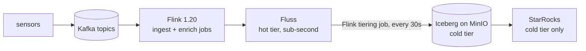

# Fluss Streamhouse (local)

A local **streamhouse**: [Apache Fluss](https://fluss.apache.org/) as the sub-second hot tier,
tiering continuously into **Apache Iceberg on MinIO**, cataloged by **Nessie**, with
**StarRocks** as an optional OLAP engine over the cold tier. Compute is **Apache Flink 1.20**.



Sensors publish JSON to the Kafka topics `iot-telemetry` and `iot-events`; Flink lands them in
Fluss, which is queryable immediately and tiers itself into Iceberg. A tiered table has two
names: `SELECT ... FROM datalake_device_telemetry` reads **hot ∪ cold**, while the `$lake`
suffix — `FROM datalake_device_telemetry$lake` — reads only the Iceberg side, as of the last
flush. Same table, two freshnesses; the difference between the two counts is what `make demo`
prints. StarRocks has no Fluss connector, so it only ever sees the cold tier — the point of
Experiment 3: the tiered data is plain Iceberg, readable by anything, with Fluss nowhere in the
path. **Kafka stays** — Fluss sits behind the broker you already have rather than replacing it.

The experiments build a **real-time IoT analytics pipeline** on it — sensors, a device dimension,
anomaly detection, a windowed fact table, a dashboard engine — and then show the two things that
make it a streamhouse rather than a lakehouse or a queue:

1. **vs a lakehouse** — the same table, same SQL, answers *now* from the hot tier while the
   Iceberg path is still waiting for the next flush.
2. **vs Kafka** — a topic holds the same records but has no index, so answering "what is order
   N?" means reading every offset.

## Docs

| | |
|---|---|
| [`docs/EXPERIMENTS.md`](docs/EXPERIMENTS.md) | run this, expect that — Experiments 0-4, the orders appendix, troubleshooting |
| [`docs/EXPLANATION.md`](docs/EXPLANATION.md) | the why — the argument, the hard constraints, the Fluss ⇄ Nessie ⇄ Iceberg seam, versions |
| [*Query the Stream*](https://georgioszefkilis.substack.com/p/query-the-stream-an-introduction) | the companion blog post |

---

## Prerequisites

- **Docker + Docker Compose v2**, with **≥8 GB** allocated to Docker. The taskmanager alone
  reserves 2 GB; the optional StarRocks `allin1` image wants ~4-6 GB more on top.
- **First `make up` pulls ~10 min of images** (MinIO, minio/mc, Nessie, ZooKeeper, Fluss, Flink,
  Kafka). `make jars` fetches 15 jars from Maven Central into `lib/` (gitignored, cached).
- **Ports** that must be free: `8083` `9000` `9001` `19120` `9092`, plus `9030` `8030` `8040`
  if you run Experiment 3.
- `make sr-sql` needs a **`mysql` client on the host**. If you do not have one:
  `docker compose exec starrocks mysql -h 127.0.0.1 -P 9030 -u root`.

## Quick start

The happy path, in order. Only steps 1 and 5 block — everything else returns immediately and
leaves Flink jobs running in the background.

| # | Command | Blocks? | Result |
|---|---|---|---|
| 1 | `make up` | ~2 min (+pulls) | whole stack up; ends with the `verify.sh` gate |
| 2 | `make sql`, paste `sql/07-iot-produce.sql` &nbsp;*or*&nbsp; `make produce` | no | 2 jobs publishing to Kafka, ~66 min of sensor data |
| 3 | `make sql`, paste `sql/08-iot-pipeline.sql` | no | 5 Fluss tables, 4 detached jobs |
| 4 | `make tiering` | no | tiering job appears in the Flink UI |
| 5 | `make demo` | ~90 s | the hot-vs-cold contrast |

Steps 2-4 are [Experiment 1](docs/EXPERIMENTS.md#experiment-1--a-real-time-iot-pipeline-on-the-streamhouse),
step 5 is [Experiment 2](docs/EXPERIMENTS.md#experiment-2--query-hot-and-cold-on-the-go). Then
[Experiment 3](docs/EXPERIMENTS.md#experiment-3--starrocks-reads-the-cold-tier-only) (`make starrocks`)
and [Experiment 4](docs/EXPERIMENTS.md#experiment-4--why-not-just-kafka) (`make bench`).

UIs: Flink [`:8083`](http://localhost:8083) · MinIO console [`:9001`](http://localhost:9001)
(admin/password) · Nessie [`:19120`](http://localhost:19120).

## Commands

```bash
make up          # jars + whole stack + verify gate
make verify      # liveness gate (containers, endpoints, TM registration, buckets)
make sql         # interactive Flink SQL client; paste sql/*.sql by hand
make produce     # Experiment 1 ingress as a Python producer instead of sql/07 (run one, not both)
make tiering     # submit the Fluss→Iceberg tiering job
make demo        # Experiment 2: loops sql/09-iot-contrast.sql  (`N=12` for more iterations)
make demo-orders # same, on the orders appendix
make starrocks   # Experiment 3 overlay        make sr-sql  # its SQL shell
make bench       # Experiment 4: Fluss vs Kafka point-lookup cost
make ps / logs   # container states / Fluss server logs
make down        # docker compose down -v — the correct full reset
make clean       # down, plus delete lib/*.jar
```

Concurrent SQL sessions are fine — `make sql` runs a throwaway container each time, and
Experiments 2 and 4 both want two at once.

## Repo layout

| Path | What |
|---|---|
| `docs/EXPERIMENTS.md` | the experiments — **start here to run it** |
| `docs/EXPLANATION.md` | the argument, the constraints, the seam — **read this to change things** |
| `docker-compose.yml` | ZK, MinIO(+init), Nessie, Fluss (coordinator+tablet), Flink (JM/TM/sql-client), Kafka |
| `docker-compose.starrocks.yml` | Experiment 3 overlay |
| `scripts/download-jars.sh` | fetches `lib/*.jar` (mounted into Flink + Fluss) |
| `scripts/verify.sh` | the liveness gate |
| `scripts/start-tiering.sh` | submits the Fluss→Iceberg tiering job |
| `scripts/demo.sh` | loops a contrast query; `SQL_FILE=` picks which |
| `scripts/bench.sh` | runs `sql/06`, reads job durations from the Flink REST API |
| `sql/07-iot-produce.sql` | **Experiment 1** — sensors → the Kafka topics (swap in your own producer) |
| `scripts/iot_producer.py` | **Experiment 1** — the same sensors in Python (`make produce`), an alternative to `sql/07` |
| `sql/08-iot-pipeline.sql` | **Experiment 1** — Kafka → Fluss → the two tiered tables |
| `sql/09-iot-contrast.sql` | **Experiment 2** — hot vs cold, `-f`-safe (what `make demo` loops) |
| `sql/10-iot-live.sql` | **Experiment 2** — live queries, interactive only |
| `sql/04-starrocks.sql` | **Experiment 3** — external Iceberg catalog + the dashboard panels |
| `sql/05-bench-load.sql` | **Experiment 4** — bulk load into both Fluss and Kafka |
| `sql/06-bench-query.sql` | **Experiment 4** — the same point query, two engines |
| `sql/01-tables.sql` | appendix — orders catalog, PK tables, the tiered table |
| `sql/02-ingest-and-query.sql` | appendix — faker → Fluss, lookup-join enrichment, union read |
| `sql/03-contrast.sql` | appendix — the orders hot-vs-cold query |

Stack versions are in [`docs/EXPLANATION.md`](docs/EXPLANATION.md#stack--versions).
