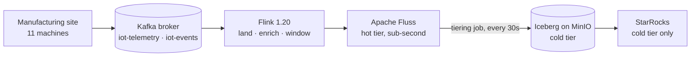

# Fluss Streamhouse (local)

A local **streamhouse**: [Apache Fluss](https://fluss.apache.org/) as the sub-second hot tier,
tiering continuously into **Apache Iceberg on MinIO**, cataloged by **Nessie**, with
**StarRocks** as an optional OLAP engine over the cold tier. Compute is **Apache Flink 1.20**.



Machines publish JSON to the Kafka topics `iot-telemetry` and `iot-events`; Flink lands them in
Fluss, which is queryable immediately and tiers itself into Iceberg. A tiered table has two
names: `SELECT ... FROM datalake_device_telemetry` reads **hot ∪ cold**, while the `$lake`
suffix — `FROM datalake_device_telemetry$lake` — reads only the Iceberg side, as of the last
flush. Same table, two freshnesses; the difference between the two counts is what `make demo`
prints. StarRocks has no Fluss connector, so it only ever sees the cold tier — the point of
Experiment 1's last part: the tiered data is plain Iceberg, readable by anything, with Fluss
nowhere in the path. **Kafka stays** — Fluss sits behind the broker you already have rather than replacing it.

There are **three experiments**, one per claim. Experiment 1 builds the real-time IoT pipeline —
sensors, a device dimension, anomaly detection, a windowed fact table, a dashboard engine — and
queries it hot and cold; Experiment 2 prices a point lookup against Kafka and against Fluss;
Experiment 3 publishes a curated table through a Nessie branch:

1. **vs a lakehouse** — the same table, same SQL, answers *now* from the hot tier while the
   Iceberg path is still waiting for the next flush.
2. **vs Kafka** — a topic holds the same records but has no index, so answering "what is reading
   N?" means reading every offset.
3. **vs medallion staging** — the catalog is a git repo, so a curated table is written and
   audited on a branch and merged into `main` only if it passes. No copy per layer, and a failed
   check never stops ingest. It happens entirely in the lake: Flink is the compute, Fluss is only
   the source, and the publish itself is one Nessie call that moves a ref.

Everything here is **Python or SQL**: `scripts/iot_producer.py` produces, Flink SQL processes.

## Docs

| | |
|---|---|
| [`docs/EXPERIMENTS.md`](docs/EXPERIMENTS.md) | run this, expect that — the two experiments and troubleshooting |
| [`docs/EXPLANATION.md`](docs/EXPLANATION.md) | the why — the argument, the hard constraints, the Fluss ⇄ Nessie ⇄ Iceberg seam, versions |
| [*Query the Stream*](https://georgioszefkilis.substack.com/p/query-the-stream-an-introduction) | the companion blog post |

---

## Prerequisites

- **Docker + Docker Compose v2**, with **≥8 GB** allocated to Docker. The taskmanager alone
  reserves 2 GB; the optional StarRocks `allin1` image wants ~4-6 GB more on top.
- **First `make up` pulls ~10 min of images** (MinIO, minio/mc, Nessie, ZooKeeper, Fluss, Flink,
  Kafka). `make jars` fetches 15 jars from Maven Central into `lib/` (gitignored, cached).
- **Ports** that must be free: `8083` `9000` `9001` `19120` `9092`, plus `9030` `8030` `8040`
  for the StarRocks part.
- `make sr-sql` uses the host's **`mysql` client** if there is one and the container's otherwise,
  so a bare macOS shell is fine.

## Quick start

The happy path, in order. Only steps 1 and 5 block — everything else returns immediately and
leaves Flink jobs running in the background.

| # | Command | Blocks? | Result |
|---|---|---|---|
| 1 | `make up` | ~2 min (+pulls) | whole stack up; ends with the `verify.sh` gate |
| 2 | `make produce` | no | the Python device fleet publishing to Kafka, ~66 min of sensor data |
| 3 | `make sql`, paste `sql/common/catalog.sql` then `sql/exp1-pipeline.sql` | no | 5 Fluss tables, 2 detached jobs |
| 4 | `make tiering` | no | tiering job appears in the Flink UI |
| 5 | `make demo` | ~90 s | the hot-vs-cold contrast |

Steps 2-5 are [Experiment 1](docs/EXPERIMENTS.md#experiment-1--the-pipeline-and-querying-hot-and-cold),
parts A-C; part D adds StarRocks over the cold tier (`make starrocks`). Then
[Experiment 2](docs/EXPERIMENTS.md#experiment-2--offsets-vs-an-index-why-not-just-kafka)
(`make bench-load`, then `make bench`) and
[Experiment 3](docs/EXPERIMENTS.md#experiment-3--write-audit-publish-on-a-nessie-branch)
(`make wap`).

UIs: Flink [`:8083`](http://localhost:8083) · MinIO console [`:9001`](http://localhost:9001)
(admin/password) · Nessie [`:19120`](http://localhost:19120).

## Commands

```bash
make up          # jars + whole stack + verify gate
make verify      # liveness gate (containers, endpoints, TM registration, buckets)
make sql         # interactive Flink SQL client; paste sql/common/catalog.sql, then a file
make produce     # Experiment 1 ingress: the Python device fleet -> Kafka
make tiering     # submit the Fluss→Iceberg tiering job
make demo        # Exp 1 part C: loops sql/exp1-contrast.sql  (`N=12` for more iterations)
make starrocks   # Exp 1 part D: StarRocks overlay   make sr-sql  # its SQL shell
make bench-load  # Exp 2: bulk-load bench-telemetry into Kafka + a Fluss PK table
make bench       # Exp 2: the same point query on each
make wap         # Exp 3: write-audit-publish on a Nessie branch
make wap-break   # Exp 3: the same, with a corrupt row — the audit refuses to merge
make ps / logs   # container states / Fluss server logs
make down        # docker compose down -v — the correct full reset
make clean       # down, plus delete lib/*.jar
```

Concurrent SQL sessions are fine — `make sql` runs a throwaway container each time.

## Repo layout

| Path | What |
|---|---|
| `docs/EXPERIMENTS.md` | the experiments — **start here to run it** |
| `docs/EXPLANATION.md` | the argument, the constraints, the seam — **read this to change things** |
| `docker-compose.yml` | ZK, MinIO(+init), Nessie, Fluss (coordinator+tablet), Flink (JM/TM/sql-client), Kafka, the two producers |
| `docker-compose.starrocks.yml` | the StarRocks overlay (Exp 1 part D) |
| `scripts/iot_producer.py` | **the ingress** — sensors → Kafka (`make produce`), and Exp 2's bulk load (`make bench-load`) |
| `scripts/download-jars.sh` | fetches `lib/*.jar` (mounted into Flink + Fluss) |
| `scripts/verify.sh` | the liveness gate |
| `scripts/start-tiering.sh` | submits the Fluss→Iceberg tiering job |
| `scripts/demo.sh` | loops a contrast query; `SQL_FILE=` picks which |
| `scripts/bench.sh` | runs `sql/exp2-bench-query.sql`, reads job durations from the Flink REST API |
| `scripts/wap.py` | **Exp 3** — branch, publish, audit, merge; stdlib only (`make wap`) |
| `sql/common/catalog.sql` | the `fluss_catalog` DDL every session needs first |
| `sql/exp1-pipeline.sql` | **Exp 1 part B** — Kafka → Fluss → the tiered tables |
| `sql/exp1-contrast.sql` | **Exp 1 part C** — hot vs cold, `-f`-safe (what `make demo` loops) |
| `sql/exp1-live.sql` | **Exp 1 part C** — live queries, interactive only |
| `sql/exp1-starrocks.sql` | **Exp 1 part D** — external Iceberg catalog + the dashboard panels |
| `sql/exp2-bench-load.sql` | **Exp 2** — `bench-telemetry` → a Fluss PK table |
| `sql/exp2-bench-query.sql` | **Exp 2** — the same point query, two engines |
| `sql/exp3-publish.sql` | **Exp 3** — write the curated table onto the `audit` branch |
| `sql/exp3-audit.sql` | **Exp 3** — the checks, emitting `WAP_PASS` / `WAP_FAIL` |
| `sql/exp3-poison.sql` | **Exp 3** — the deliberate defect for `make wap-break` |
| `sql/exp3-starrocks-branches.sql` | **Exp 3** — the same table on two refs, read from StarRocks |

Stack versions are in [`docs/EXPLANATION.md`](docs/EXPLANATION.md#stack--versions).
