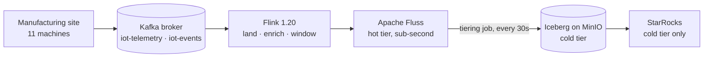

# Fluss Streamhouse (local)

A local **streamhouse**: [Apache Fluss](https://fluss.apache.org/) as the sub-second hot tier,
tiering continuously into **Apache Iceberg on MinIO**, cataloged by **Nessie**, with
**StarRocks** as an optional OLAP engine over the cold tier. Compute is **Apache Flink 1.20**.


```mermaid
flowchart LR
  S["Manufacturing site<br/>11 machines"] --> K[("Kafka broker<br/>iot-telemetry · iot-events")]
  K --> FL["Flink 1.20<br/>land · enrich · window"]
  FL --> F["Apache Fluss<br/>hot tier, sub-second"]
  F -->|tiering job, every 30s| I[("Iceberg on MinIO<br/>cold tier")]
  I --> SR["StarRocks<br/>cold tier only"]
```

Machines publish JSON to the Kafka topics `iot-telemetry` and `iot-events`; Flink lands them in
Fluss, which is queryable immediately and tiers itself into Iceberg. A tiered table has two
names: `SELECT ... FROM datalake_device_telemetry` reads **hot ∪ cold**, while the `$lake`
suffix — `FROM datalake_device_telemetry$lake` — reads only the Iceberg side, as of the last
flush. Same table, two freshnesses; the difference between the two counts is what `make demo`
prints. StarRocks has no Fluss connector, so it only ever sees the cold tier — which is the
point of the last step: the tiered data is plain Iceberg, readable by anything, with Fluss
nowhere in the path. **Kafka stays** — Fluss sits behind the broker you already have rather than
replacing it.

The tutorial builds one real-time IoT pipeline end to end — sensors, a device dimension,
per-device anomaly detection, a windowed fact table, a dashboard engine — and queries it hot and
cold. The claim it makes: the same table, same SQL, answers *now* from the hot tier while the
Iceberg path is still waiting for the next flush, and that Iceberg copy is ordinary Iceberg
anyone can read.

Everything here is **Python or SQL**: `scripts/iot_producer.py` produces, Flink SQL processes.

## Docs

| | |
|---|---|
| [`docs/TUTORIAL.md`](docs/TUTORIAL.md) | run this, expect that — the six steps, why it is built this way, troubleshooting |
| [*Query the Stream*](https://georgioszefkilis.substack.com/p/query-the-stream-an-introduction) | the companion blog post |

---

## Prerequisites

- **Docker + Docker Compose v2**, with **≥8 GB** allocated to Docker. The taskmanager alone
  reserves 2 GB; the optional StarRocks `allin1` image wants ~4-6 GB more on top.
- **First `make up` pulls ~10 min of images** (MinIO, minio/mc, Nessie, ZooKeeper, Fluss, Flink,
  Kafka). `make jars` fetches 15 jars from Maven Central into `lib/` (gitignored, cached).
- **Ports** that must be free: `8083` `9000` `9001` `19120` `9092`, plus `9030` `8030` `8040`
  for the StarRocks step.
- `make sr-sql` uses the host's **`mysql` client** if there is one and the container's otherwise,
  so a bare macOS shell is fine.

## Quick start

The happy path, in order. Only steps 0 and 4 block — everything else returns immediately and
leaves Flink jobs running in the background.

| # | Command | Blocks? | Result |
|---|---|---|---|
| 0 | `make up` | ~2 min (+pulls) | whole stack up; ends with the `verify.sh` gate |
| 1 | `make produce` | no | the Python device fleet publishing to Kafka, ~66 min of sensor data |
| 2 | `make sql`, paste `sql/catalog.sql` then `sql/01-pipeline.sql` | no | 5 Fluss tables, 2 detached jobs |
| 3 | `make tiering` | no | tiering job appears in the Flink UI |
| 4 | `make demo` | ~90 s | the hot-vs-cold contrast |
| 5 | `make starrocks`, then `make sr-sql` | ~2 min | StarRocks over the cold tier |

Each step, with what a pass looks like and what the failures mean, is in
[`docs/TUTORIAL.md`](docs/TUTORIAL.md).

UIs: Flink [`:8083`](http://localhost:8083) · MinIO console [`:9001`](http://localhost:9001)
(admin/password) · Nessie [`:19120`](http://localhost:19120).

## Commands

```bash
make up          # jars + whole stack + verify gate
make verify      # liveness gate (containers, endpoints, TM registration, buckets)
make sql         # interactive Flink SQL client; paste sql/catalog.sql, then a file
make produce     # step 1: the Python device fleet -> Kafka
make tiering     # step 3: submit the Fluss→Iceberg tiering job
make demo        # step 4: loops sql/03-contrast.sql  (`N=12` for more iterations)
make starrocks   # step 5: StarRocks overlay   make sr-sql  # its SQL shell
make ps / logs   # container states / Fluss server logs
make down        # docker compose down -v — the correct full reset
make clean       # down, plus delete lib/*.jar
```

Concurrent SQL sessions are fine — `make sql` runs a throwaway container each time.

## Repo layout

| Path | What |
|---|---|
| `docs/TUTORIAL.md` | the tutorial — **start here**, and read it before changing things |
| `docker-compose.yml` | ZK, MinIO(+init), Nessie, Fluss (coordinator+tablet), Flink (JM/TM/sql-client), Kafka, the producer |
| `docker-compose.starrocks.yml` | the StarRocks overlay (step 5) |
| `scripts/iot_producer.py` | **the ingress** — sensors → Kafka (`make produce`) |
| `scripts/download-jars.sh` | fetches `lib/*.jar` (mounted into Flink + Fluss) |
| `scripts/verify.sh` | the liveness gate |
| `scripts/start-tiering.sh` | submits the Fluss→Iceberg tiering job |
| `scripts/demo.sh` | loops a contrast query; `SQL_FILE=` picks which |
| `sql/catalog.sql` | the `fluss_catalog` DDL every session needs first |
| `sql/01-pipeline.sql` | **step 2** — Kafka → Fluss → the tiered tables |
| `sql/02-live.sql` | **step 4** — live queries, interactive only |
| `sql/03-contrast.sql` | **step 4** — hot vs cold, `-f`-safe (what `make demo` loops) |
| `sql/04-starrocks.sql` | **step 5** — external Iceberg catalog + the dashboard panels |

Stack versions are in [`docs/TUTORIAL.md`](docs/TUTORIAL.md#stack--versions).
