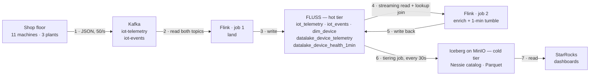

# Build the Streamhouse: Kappa and Lambda in One Pattern

*Part 2 of the streamhouse series. [Part 1: Query the Stream — An Introduction to the Streamhouse Pattern](https://medium.com/data-engineer-things/query-the-stream-an-introduction-to-the-streamhouse-pattern-25f1afc1e961)*

---

In my previous article I covered what the streamhouse pattern is and how Apache Fluss makes it
work. The part that stayed with me was being able to query the stream directly.

So this time I built one. I took the Kappa pipeline from an older post — IoT sensors on
manufacturing devices, Kafka in, StarRocks out — and rebuilt the middle of it on Fluss, to find
out whether querying the stream is actually worth it in practice.

What I ended up with is the thing I did not expect. It is one pipeline that behaves like Kappa
and like Lambda at the same time, without keeping two copies of the data. The hot tier answers in
milliseconds and is the streaming path. The same table's cold tier is plain Iceberg on object
storage, thirty seconds behind, and is the batch path. Same table name, same SQL, one write.

Everything below runs locally: Docker Compose, a Python producer, and about ten minutes of SQL.
Repo at the end.

## Business Scenario: Industrial IoT Monitoring

A manufacturing company uses IoT sensors to monitor the health of industrial machines. The sensors
emit two streams onto two Kafka topics.

**Telemetry** — energy usage, temperature, vibration, one reading per device:

```json
{"reading_id": 19974442, "device_id": "device_9", "event_time": "2026-09-09T19:21:03.810",
 "energy_usage": 1.19, "temperature": 22.6, "vibration": 0.9, "signal_strength": 70}
```

**Event logs** — failures, maintenance, inspections. Every event carries `device_id`, `event_time` and
`severity`; beyond those, only the fields belonging to its `event_type` are present.

```json
{"device_id": "device_11", "event_time": "2026-09-09T19:21:03.032", "event_type": "failure",
 "severity": "low", "error_code": "ERR1221", "component": "bearing", "root_cause": "unknown"}
```

Each machine carries **its own** temperature threshold, so "too hot" is a per-device question,
not a global one.

The core requirement is to process temperature telemetry in real time and enrich it with
contextual operational data. Specifically, the system should:

- Aggregate temperature readings per device over a 1-minute window.
- Detect anomalies by comparing readings against that device's own threshold.
- Keep the event log available alongside the telemetry, so operational context can be attached
  to any anomaly.

For each 1-minute window, we want to answer:

- Is the behaviour anomalous against that device's threshold, and how much of the window was
  spent over it?
- What were the individual readings behind that window?
- What operational events occurred in the same time frame — failures, maintenance, inspections,
  severity?

## The architecture: who does what



Three components do the work, and it is worth being precise about which does what.

**Kafka** takes the readings in and does nothing else — edges 1 and 2. **Flink** does all of the
compute: it reads both topics (2), enriches and flags each reading, and closes the one-minute
windows (4). **Fluss** is the storage, and this is the part that makes it a streamhouse rather
than a streaming job with a sink. Each Flink stage writes into a Fluss table instead of carrying
its result forward as job state (3 and 5), and those tables are readable while the jobs are still
writing to them. **StarRocks** sits at the end for dashboards (7).

Edges 4 and 5 are the loop worth looking at twice: Flink reads a Fluss table *as a stream while
job 1 is still writing it*, and writes the result straight back into the same store. That is the
thing a topic cannot do.

Underneath, Fluss tiers itself (6). Every 30 seconds it flushes committed rows into Iceberg on
MinIO, catalogued by Nessie — no sink to write, no compaction job to schedule, no second catalog
to keep in sync. **Tiered means copied rather than moved**: a tiered table lives in both tiers at
once, the Fluss log holding everything including the last few seconds, Iceberg holding everything
up to the last flush. Both answer to one table name. Ask for `datalake_device_telemetry` and you
get the union of hot and cold; ask for `datalake_device_telemetry$lake` and you get only what has
been flushed. That difference is the whole experiment, and I come back to it later in the post.

Five tables come out of this, and they fall into three groups.

**Two are the topics landing unchanged.** `iot_telemetry`, one row per reading, and `iot_events`,
one row per event with the type-specific columns arriving sparse and staying that way. Nothing is
derived here. In a Kappa-style job this stage exists only as a deserialized record inside the job;
here it is a table you can query.

**One is a dimension.** `dim_device` holds the eleven devices and their temperature thresholds,
keyed by `device_id`, and it is the build side of the lookup join — the only table in the pipeline
that gets a primary key, for reasons I will come back to.

**The last two are what Flink derives.** `datalake_device_telemetry` is every reading joined to
its device's threshold with the anomaly flagged: one row in, one row out, no windowing, so the
flag is available as soon as the reading is. This is the table I would actually query during an
incident. `datalake_device_health_1min` is the fact table — one row per device per minute, with
reading count, anomaly count, and average, min and max temperature.

That window earns its place for cost rather than capability. It collapses a minute of readings
per device into a single row, so a dashboard reads thousands of rows instead of millions. When a
question does not fit the window, you drop to `datalake_device_telemetry` and ask there.

Events get no derived stage at all. They land, they tier, and the join to readings happens at
read time in whatever query needs it — because events are readable the moment they arrive, the
join can wait for the question rather than being decided in advance.

## Building it

```bash
make up        # Flink, Fluss, Nessie, MinIO, Kafka
make produce   # 50 readings/s onto the two topics
make sql       # Flink SQL client — paste catalog.sql, then 01-pipeline.sql
make tiering   # start moving hot → cold
```

Four commands from nothing to a running pipeline. The DDL, the gotchas and the step-by-step are
all in the repo; what is worth walking through here is the three pieces that make it a
streamhouse — how data gets in, what Flink does with it, and how the cold tier fills itself.

### Ingestion

Kafka takes the readings and nothing else. The producer publishes JSON to `iot-telemetry` and
`iot-events`, and the topics, the field names and the encoding are the whole contract — swap in
any producer that writes the same shapes and nothing downstream changes.

The first Flink job lands both topics into Fluss tables, unchanged. That is already the departure
from Kappa: the raw reading is a row in a table you can query, not a deserialized record living
inside a job.

Eleven machines across three plants, each with its own temperature threshold spread from 24.0 to
29.0 °C, while the producer draws temperature uniformly from 18 to 30 °C. That detail matters at
the end — it is what makes the final ranking mean something rather than be a number I can't
check.

### The pipeline

Flink reads what it just landed and enriches it:

```sql
INSERT INTO datalake_device_telemetry
SELECT t.device_id, t.event_time, t.temperature,
       d.temp_threshold,
       t.temperature > d.temp_threshold AS anomaly_flag
FROM iot_telemetry AS t
JOIN dim_device FOR SYSTEM_TIME AS OF t.ptime AS d
  ON t.device_id = d.device_id;
```

`FOR SYSTEM_TIME AS OF` makes it a lookup join — one point lookup against `dim_device` per
incoming reading, rather than a second stream held in state. `dim_device` is the only primary-key
table in the pipeline, and this is what the key is for.

The source is a Fluss table, the sink is a Fluss table, and the landing job is still writing the
source while this one reads it. Edges 4 and 5 from the diagram, in one statement: the
intermediate result is a real table, readable by anything, and it is also the input to the next
stage.

That next stage is the one-minute window, a **processing-time** tumble. Which means a reading
lands in whichever window was open when it arrived, not the one its own timestamp belongs to — a
sensor that goes offline and dumps an hour of backlog would put all of it in one minute. Event
time is a `WATERMARK` clause away; the repo says what else changes with it.

### Tiering

Every tiered table carries two properties and nothing else:

```sql
'table.datalake.enabled'   = 'true',
'table.datalake.freshness' = '30s'
```

`enabled` gives the Fluss table an Iceberg twin; `freshness` sets how often committed rows are
flushed into it. That is the entire configuration of the cold tier — no sink to write, no
compaction job to schedule, no catalog registration, no second copy of the schema to keep in
step. (What the DDL does *not* have is a primary key: union read on a tiered PK table is not
implemented in `fluss-lake-iceberg` 0.9.1, which is why `dim_device` is the one table never
tiered.)

Two things about it are worth knowing, and both show up as the demo.

The Iceberg table appears in Nessie **at `CREATE TABLE`**, not when tiering starts — the Fluss
coordinator registers an empty table and writes a metadata file to MinIO before a single row
exists. And `make tiering` is a **separate step** from creating the tables and starting the jobs,
so there is a window where the pipeline is live, readings are arriving, every table answers a
query, and the lake side of every one of them is still empty. An empty `$lake` next to a live
Nessie entry is the normal intermediate state, not a broken one.

Run it, and everything is up: readings on Kafka, two jobs in Flink, five tables in Fluss, four of
them growing an Iceberg copy in the background every thirty seconds. Which sets up the question
the post opened with. If the hot tier really does answer *now* while the lake is a flush behind,
that difference should be visible in a query. So let's look.

## Demo 1 — query the stream

```sql
SET 'execution.runtime-mode' = 'streaming';
SET 'sql-client.execution.result-mode' = 'table';

SELECT device_id, location_id, temperature, temp_threshold, vibration, event_time
FROM datalake_device_telemetry
WHERE anomaly_flag OR vibration_spike;
```

Rows scroll past as the sensors emit them. It is a streaming read of a *tiered* table: it opens
on the Iceberg snapshot and switches to the Fluss log, so you are watching hot ∪ cold advance in
one query. In Kappa that data is job state — there is nothing to point a SELECT at.

Watching a feed scroll is a debugging pleasure, not a business case. Here is the business case.

**The triage scenario.** A dashboard row goes red: `device_1`, last minute, 31 of 50 readings
over threshold. Three questions follow immediately, and all three are SQL against tables that
already exist.

```sql
SET 'execution.runtime-mode' = 'batch';

-- 1. which device, which minute
SELECT device_id, window_start, cnt_points, cnt_anomalies,
       round(max_temperature, 1) AS max_c, threshold_used
FROM datalake_device_health_1min
ORDER BY window_start DESC, cnt_anomalies DESC
LIMIT 5;

-- 2. the readings behind that row — per reading, not per minute
SELECT reading_id, event_time, temperature, temp_threshold, vibration, signal_strength
FROM datalake_device_telemetry
WHERE device_id = 'device_1'
  AND event_time > CURRENT_TIMESTAMP - INTERVAL '3' MINUTE
ORDER BY event_time DESC
LIMIT 20;

-- 3. did the machine log anything at the same time?
--    joined at read time, not baked into the pipeline
SELECT event_time, event_type, severity, error_code, component, root_cause
FROM iot_events
WHERE device_id = 'device_1'
  AND event_time > CURRENT_TIMESTAMP - INTERVAL '3' MINUTE;
```

Query 2 is the one that matters. It is the drill-down from the aggregate to the evidence, and in
Kappa it does not exist: the per-reading rows were job state, so the only place they survive is
the topic, where answering "device_1, last three minutes" means scanning offsets. Query 3 is a
join Kappa had to commit to in advance, because the fact table was the only readable thing.

Now run query 2 again against `datalake_device_telemetry$lake`. Fewer rows, and usually nothing
from the last thirty seconds. A lakehouse reader cannot answer this question yet. The streamhouse
answered it while the incident was still happening.

That is the real advantage, and it is not debugging. An operational question gets answered
against production tables, at the grain it is asked, with no new job, no new topic and no replay.
The same goes for a changed rule: move the vibration threshold from 3.0 to 2.5 and re-ask over
hot ∪ cold. You get the new answer over history *and* over the last ten seconds, from one query.

One caveat: the bare table is not readable in batch mode until the first flush exists
(`Batch mode can only be supported if one lake snapshot exists`). Wait thirty seconds after
`make tiering`.

## Demo 2 — the gap, and the small files problem

```bash
make demo
```

```
+---------------+-----------+------------------+
| hot_plus_cold | cold_only | rows_only_in_hot |
+---------------+-----------+------------------+
|         14700 |     14100 |              600 |
+---------------+-----------+------------------+
```

`rows_only_in_hot` is 600 readings that exist, are enriched, are queryable, and are not on the
Iceberg path yet. Watch `cold_only` across iterations and it advances in visible thirty-second
steps — that is `table.datalake.freshness`. Cancel the tiering job in the Flink UI and `cold_only`
freezes while `hot_plus_cold` keeps climbing. Restart it and the cold number catches up in one
jump. The two tiers are visibly independent.

A note on how that number is produced, because the obvious version is wrong: the producer draws
`reading_id` at random, so `max(reading_id)` is not the newest row and a max-based freshness test
reports a false negative. The honest test is an anti-join against `$lake`, which names actual
readings that are not in the lake yet.

This is also where the storage argument lands. You can write the middle layers out to object
storage yourself, of course. But then you are choosing: flush often and get fresh data in a pile
of small files, or flush rarely and get decent files that are minutes behind. Either way you now
own a sink, a compaction job and a catalog to make the files queryable.

The streamhouse does not abolish that trade-off. It moves it somewhere it stops mattering. You
still pick a flush interval — you just pick it for file size now, not for freshness, because
freshness is the hot tier's job. Thirty seconds here is a demo number. Make it five minutes and
every query above still answers the same, because the bare table reads both tiers. The sink, the
compaction and the catalog entry are Fluss's problem, not mine.

## Demo 3 — the cold tier is just Iceberg

```bash
make starrocks
```

StarRocks has no Fluss connector. It registers an external Iceberg catalog against Nessie and
reads Parquet out of MinIO. Fluss is not in this path at all:

```sql
CREATE EXTERNAL CATALOG iceberg_nessie PROPERTIES (
  "type" = "iceberg",
  "iceberg.catalog.type" = "rest",
  "iceberg.catalog.uri" = "http://nessie:19120/iceberg/main",
  "iceberg.catalog.warehouse" = "warehouse",
  ...
);

SELECT device_id,
       max(threshold_used) AS threshold,
       sum(cnt_anomalies)  AS anomalous_readings,
       round(100.0 * sum(cnt_anomalies) / sum(cnt_points), 1) AS pct_over_threshold
FROM datalake_device_health_1min
GROUP BY device_id
ORDER BY pct_over_threshold DESC;
```

```
device_id  threshold  anomalous_readings  pct_over_threshold
device_1        24.0                 819                50.2
device_2        24.5                 752                46.2
device_3        25.0                 667                41.3
...
device_10       28.5                 208                12.9
device_11       29.0                 111                 7.1
```

That monotonic fall from 50% to 7% is the end-to-end proof, and it matches theory: temperature is
drawn uniformly from 18 to 30 °C, so a device with a 24.0 °C threshold should sit over it about
half the time and one at 29.0 °C about a twelfth. Those per-device thresholds were resolved by a
lookup join in Flink, tiered to Iceberg, and read here by an engine that has never heard of
Fluss. Nothing was re-modelled and nothing was copied a second time.

Run `SELECT count(*)` here and it comes back *below* the union-read count from demo 2. StarRocks
is reading one tier behind, which is exactly right for a batch consumer — and it is the Lambda
half of the claim. The same table that answered a sub-second operational question is also a plain
Iceberg table you can point Spark, Trino, dbt or a nightly job at.

**An option I did not take.** If you want StarRocks itself to be sub-second — a dashboard
refreshing every second rather than every thirty — you can point a Flink StarRocks sink at the
same enriched stream and write to a primary-key table directly, alongside the tiering. I have not
wired that into this lab, and it is worth being clear about why it is a choice and not an
upgrade: it is a second copy, the exact thing the pattern otherwise removes. The difference from
Lambda is that this copy is a cache you can drop and rebuild from the tables above, not the only
place the data exists. Serving-layer decision, not a storage one.

## One more thing: the catalog is a git repo

Everything above puts the cold tier in Iceberg under a Nessie catalog, and Nessie is a git-shaped
catalog — branches, commits, merges over table metadata.

Which means you can write a curated table to a branch, run your quality checks on the branch, and
merge to `main` only if they pass. The interesting part is that this works while the stream is
still running. The tiering job keeps committing its tables to `main`, the branch only touches the
curated ones, and Nessie merges per table, so there is nothing to conflict over. A failed quality
gate becomes an unmerged branch and an alert, not a stopped pipeline. And a consumer can read the
candidate: same SQL, same table name, one catalog property different.

That is a post of its own, and it is the next one.

## Closing

Two demos, one table. The per-reading table answered an incident question in milliseconds, and
the same rows, thirty seconds later, were Parquet in object storage that StarRocks aggregated
without knowing Fluss exists. That is Kappa's latency and Lambda's batch surface, from one write
and one copy of the data.

Which leaves Kafka as the way readings get in, not the place they live. Retention is a buffer
decision again. The history is in Iceberg.

The whole lab is here: [repo link]. `make up`, `make produce`, and the SQL above.
