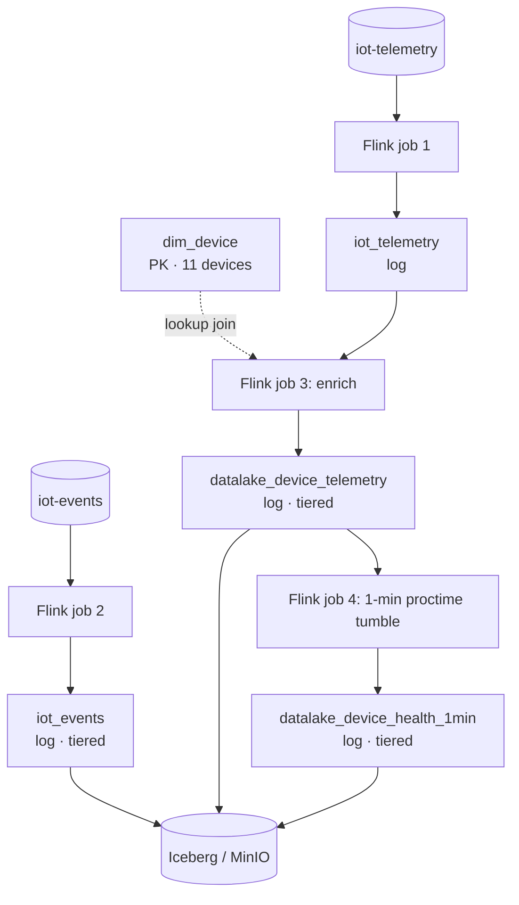

# Experiments

Run this, expect that. The *why* is in [EXPLANATION.md](EXPLANATION.md); the stack and repo
layout are in the [README](../README.md).

Each experiment states what you run, what a pass looks like, and what the common failures mean.
Experiments 1 → 3 build on each other; Experiment 4 is standalone.

## Experiment 0 — bring the stack up

```bash
make up          # or `make verify` on its own, any time
```

**Pass:** every line ✓, exit 0, ending in `All components up and wired. Safe to build.`

Checks container states, MinIO/Nessie/Flink endpoints, that a TaskManager actually registered
with the JobManager, and that both buckets exist. It is a **liveness gate only** — it does not
assert the Fluss→Iceberg tiering seam, which does not exist until `make tiering`.

**When it fails:**
- *Fluss containers restarting* — expected on first bring-up. They use `restart: on-failure` to
  survive the Nessie boot race; `depends_on` waits for container start, not for Quarkus to be
  serving `:19120`. Give it a minute.

---

## Experiment 1 — a real-time IoT pipeline on the streamhouse

**Builds:** sensors → Kafka → Fluss → two tiered tables → Iceberg. This is the pipeline
everything else queries.

### Step 1 — put sensor data on Kafka

```bash
make sql                          # paste sql/07-iot-produce.sql
```

Prefer a producer that looks like a producer? `make produce` runs `scripts/iot_producer.py` in a
container instead — a `confluent-kafka` fleet on the same two topics, same JSON, same rates, so
`sql/08` onward is unchanged. Run one or the other, never both, or you get double the data.

Two detached jobs publish JSON to `iot-telemetry` and `iot-events`, keyed on nothing in
particular and shaped exactly like a real device fleet would send it:

```json
{"reading_id":19974442,"device_id":"device_9","event_time":"2026-09-09T19:21:03.81",
 "energy_usage":1.19,"temperature":22.6,"vibration":0.9,"signal_strength":70}

{"device_id":"device_11","event_time":"2026-09-09T19:21:03.032","event_type":"failure",
 "severity":"low","error_code":"ERR1221","component":"bearing","root_cause":"unknown",
 "technician":null,"duration_min":null,"parts_replaced":null,
 "status":null,"next_inspection_days":null}
```

Events are a **sparse union**: only the fields belonging to a row's `event_type` are populated
(failures carry `error_code`/`component`/`root_cause`, maintenance carries
`technician`/`duration_min`/`parts_replaced`, inspections carry `status`/`next_inspection_days`).
Type mix is 10% failure / 30% maintenance / 60% inspection.

Check it landed:

```bash
docker compose exec kafka /opt/kafka/bin/kafka-console-consumer.sh \
  --bootstrap-server kafka:9092 --topic iot-telemetry --from-beginning --max-messages 2
```

**Swapping in your own producer:** nothing downstream knows flink-faker is behind this. Point
any producer at the same two topics with the same field names and Step 2 is unchanged — the
footer of `sql/07` shows the mapping for a `confluent-kafka` Python producer. Keep timestamps
ISO-8601.

### Step 2 — land it in Fluss and tier it

```bash
make sql                          # second session: paste sql/08-iot-pipeline.sql
make tiering                      # then start moving hot -> cold
```



What `sql/08` creates:

| Table | Kind | Tiered | Role |
|---|---|---|---|
| `dim_device` | **PK** on `device_id` | no | 11 devices with per-device temperature thresholds; the lookup-join build side |
| `iot_telemetry` | log | no | raw readings off `iot-telemetry`, 50/s |
| `iot_events` | log | **yes** | off `iot-events`; the sparse type-specific columns land as-is |
| `datalake_device_telemetry` | log | **yes** | every reading, enriched with its device's threshold + `anomaly_flag` + `vibration_spike` |
| `datalake_device_health_1min` | log | **yes** | the fact table: 1-minute windows per device — reading count, anomaly count, avg/min/max temp |

The pipeline is four detached Flink jobs: two reading Kafka into Fluss, two deriving. The derive
side does a **lookup join** — one point lookup against `dim_device` per incoming reading — and
then fans the result into a per-reading table and a windowed aggregate.

Thresholds are spread 24.0–29.0 °C across the eleven devices while the producer draws
temperature uniformly from 18–30 °C, so each device sits over its own threshold a different and
predictable fraction of the time. That is what makes Experiment 3's ranking mean something.

**Pass:**
- the `dim_device` seed job shows **FINISHED** in the Flink UI ([`:8083`](http://localhost:8083))
- 4 jobs **RUNNING** alongside it, plus the tiering job after `make tiering`
- within seconds:
  ```sql
  SET 'execution.runtime-mode' = 'batch';
  SELECT count(*) FROM datalake_device_telemetry;         -- non-zero and climbing
  SELECT count(*) FROM datalake_device_telemetry WHERE anomaly_flag;   -- also non-zero
  ```
- `temp_threshold`, `location_id` and `model` are populated — the lookup join is resolving
- after ~1 minute, `SELECT count(*) FROM datalake_device_health_1min` becomes non-zero

**When it fails:**
- *`Table fluss.<name> already exists` right after a `DROP TABLE`* — dropping a tiered table
  leaves an orphan in Nessie. See [Troubleshooting](#troubleshooting--reset).
- *`Table sink ... doesn't support consuming update and delete changes`* — a PK table is feeding
  an append-only sink, or the window emitted a changelog. Everything downstream of
  `iot_telemetry` must be append-only.
  [Why](EXPLANATION.md#a-log-table-sink-cannot-consume-a-pk-tables-changelog).
- *`temp_threshold` all NULL* — the `dim_device` seed did not finish before the derive jobs
  started. `sql/08` uses `SET 'table.dml-sync' = 'true'` around the seed to prevent exactly
  this; if you pasted statements out of order, re-run the seed.
- *every `event_time` is NULL, everything else populated* — a JSON timestamp-format mismatch.
  Python's `datetime.isoformat()` writes `2026-09-09T19:21:03.81` with a `T`; Flink's JSON
  format defaults to `SQL`, which wants a space, and yields NULL rather than an error. Both
  `sql/07` and `sql/08` set `'json.timestamp-format.standard' = 'ISO-8601'`; keep it if you
  swap the producer.
- *zero rows in `iot_telemetry`, jobs RUNNING* — nothing is on the topic. Run Step 1 first, or
  check `make verify` shows Kafka green.
- *`datalake_device_health_1min` stays empty past 2 minutes* — check the second derive job's
  *Exceptions* tab in the Flink UI.

---

## Experiment 2 — query hot and cold on the go

**Proves:** the freshness claim. Same table, same SQL, two read paths — the bare table unions
hot + cold, the `$lake` suffix reads cold only.

### Live, in an interactive session

```bash
make sql                          # paste sql/10-iot-live.sql
```

Section A runs in **streaming** mode with `result-mode = table`: a feed of readings over
threshold or with a vibration spike, and a rolling per-device rollup, both updating in place and
read straight off the tiered table. Section B flips to
batch and puts the three read paths side by side — `t`, `t$lake`, `t$lake$snapshots`.

`sql-client.sh -f` cannot render an updating view, so these only work interactively. Concurrent
sessions are fine — `make sql` runs a throwaway container each time.

### The contrast, on a loop

```bash
make demo                         # `make demo N=12` for more iterations
```

`make demo` loops `sql/09-iot-contrast.sql` and prints:

```
+---------------+-----------+------------------+
| hot_plus_cold | cold_only | rows_only_in_hot |
+---------------+-----------+------------------+
|         14700 |     14100 |              600 |
+---------------+-----------+------------------+

+-----------------------+-------------------+
| windows_hot_plus_cold | windows_cold_only |
+-----------------------+-------------------+
|                    44 |                33 |
+-----------------------+-------------------+

+---------------------+-----------+-------------+--------------+
| reading_only_in_hot | device_id | temperature | anomaly_flag |
+---------------------+-----------+-------------+--------------+
|             1064674 | device_5  |        18.7 |        FALSE |
|             7281523 | device_8  |        27.6 |         TRUE |
|            17267460 | device_11 |        18.3 |        FALSE |
+---------------------+-----------+-------------+--------------+

+-----------+-----------+------------+------------+
| device_id | anomalies | worst_temp | vib_spikes |
+-----------+-----------+------------+------------+
| device_1  |       711 |       30.0 |         37 |
| device_2  |       643 |       30.0 |         43 |
| device_3  |       583 |       30.0 |         15 |
+-----------+-----------+------------+------------+
```

`device_1` leading is not luck: its threshold is 24.0 °C, the lowest of the eleven. The last
query is proof the lookup join resolved a per-device threshold for every reading.

**Pass:** `rows_only_in_hot` > 0 on every iteration, `cold_only` advancing in visible ~30 s
steps (`table.datalake.freshness`), and the anti-join naming actual readings — rows you can
query in the streamhouse right now that are *not on the Iceberg path yet*.

The fact-table row behaves differently and that is worth understanding: windows only close once
a minute, while tiering flushes every 30 s, so `windows_hot_plus_cold` and `windows_cold_only`
are often **equal** — the lake has caught up because nothing new has been produced since the
last flush. Watch it across several iterations and you will see it jump by ~11 (one row per
device) and then be absorbed. A per-reading stream shows a permanent gap; a windowed aggregate
shows a sawtooth.

The second query is an **anti-join against `$lake`**, not `max(reading_id)` —
[why](EXPLANATION.md#why-the-anti-join-not-max).

### The sharper version: kill the tiering job

Cancel the tiering job in the Flink UI, then re-run `make demo`. `cold_only` **freezes** while
`hot_plus_cold` keeps climbing — the lake tier is now visibly a stale copy while the hot tier
serves. `make tiering` restarts it and the cold number catches up in one jump.

**When it fails:**
- *`cold_only` stuck at 0* — the tiering job is not running or crashed. Check the Flink UI and
  `make logs`.
- *`Batch mode can only be supported if one lake snapshot exists`* — nothing has been tiered
  yet. The bare table is not readable in batch at all until the first flush; wait ~30 s after
  `make tiering`, or check `<table>$lake` first.
- *`lake records must instance of sorted view`* — a tiered table has a PRIMARY KEY.
  [Why that is fatal](EXPLANATION.md#union-read-requires-log-tables).
- *`Trying to access closed classloader`* — Hadoop's static `FileSystem` cache pins the user
  classloader and Flink's leak check trips intermittently on repeated SQL sessions. Disabled via
  `classloader.check-leaked-classloader: false` in `docker-compose.yml`; if you see it again,
  that setting did not reach the service that threw.
- *numbers identical between iterations, or `rows_only_in_hot` = 0* — the faker source drained.
  It is finite (200,000 readings at 50/s ≈ 66 min). Once it drains, tiering catches up
  completely and the gap closes — correct behaviour, but no longer a contrast. Run `make demo`
  **while `sql/07` is still ingesting**, or reset and start over.

---

## Experiment 3 — StarRocks reads the cold tier only

**Proves:** the cold tier is just Iceberg. An OLAP engine reads it with Fluss nowhere in the
path — no connector, no coordination, no awareness that Fluss exists.

```bash
make starrocks                    # wait for the healthcheck (~1-2 min)
make sr-sql                       # paste sql/04-starrocks.sql
```

`sql/04` registers an external Iceberg catalog over Nessie, then runs the dashboard queries:
temperature vs each device's threshold, events by type and severity, and devices ranked by
anomalous windows.

**Pass:** `SHOW DATABASES FROM iceberg_nessie` lists the `fluss` database, and the third panel
ranks devices by how much time they spend over their own threshold — which comes out **ordered
by threshold**, because that is the only thing that differs between them:

```
device_id  threshold  windows  anomalous_readings  pct_over_threshold  vibration_spikes
device_1        24.0        5                 819                50.2                71
device_2        24.5        5                 752                46.2                91
device_3        25.0        5                 667                41.3                55
...
device_10       28.5        5                 208                12.9                65
device_11       29.0        5                 111                 7.1                67
```

That monotonic fall from 50.2% to 7.1% is the end-to-end proof, and it matches theory: with
temperature drawn uniformly from 18–30 °C, a device with a 24.0 °C threshold should sit over it
50% of the time and one at 29.0 °C about 8%. StarRocks is reading a fact table whose per-device
thresholds were resolved by a lookup join in Flink, tiered to Iceberg, and it never touched
Fluss on the way out.

Panel 2b is the other half of the point: `root_cause` and `component` are populated only on
`failure` rows, and that sparseness survives producer → Kafka JSON → Fluss → Iceberg →
StarRocks intact.

Then the freshness half:

```sql
SELECT count(*) FROM datalake_device_telemetry;
```

returns a value **below** the `hot_plus_cold` number from Experiment 2 — 17,100 against a union
read that was already past 19,000 on the run these numbers came from. That gap is the whole point: StarRocks sees only what tiering
has flushed. It is reading Parquet out of MinIO through a Nessie catalog — exactly what any
Iceberg-aware engine would do.

**When it fails:**
- *Catalog registers but no databases* — nothing has been tiered yet. Run Experiment 1 and
  `make tiering` first.
- *FE not healthy* — StarRocks `allin1` is memory-hungry; check Docker's allocation.
- *`mysql: command not found`* — see [Prerequisites](../README.md#prerequisites).
- *`Catalog 'iceberg_nessie' already exists`* — you should not see this; `sql/04` uses
  `IF NOT EXISTS` so it is safe to re-run. If you edited it out, `DROP CATALOG iceberg_nessie`.
- *every device shows the same anomaly rate* — the panel is reading `anomaly_flag` rather than
  `cnt_anomalies`. Over a full minute the max reading almost always clears the threshold, so the
  flag saturates; rank on the rate.
- *`Location does not exist: s3://warehouse/...`* — StarRocks is serving cached Iceberg metadata
  for files a reset deleted. `make down` now tears StarRocks down along with everything else; if
  you reset some other way, run
  `REFRESH EXTERNAL TABLE iceberg_nessie.fluss.<table>;` for each table.

---

## Experiment 4 — why not just Kafka?

**Proves:** the queryability claim. A Kafka topic and a Fluss table hold the same volume of
records over the same key space. Asking one question of each costs wildly different amounts.

This one is standalone — it uses its own orders dataset and does not touch the IoT pipeline.
It needs a **second SQL client session** alongside anything from Experiment 1.

Note this is not an argument for deleting Kafka: Experiment 1 *ingests from* Kafka. The claim is
narrower and it is about where you answer questions. A topic is a good bus and a bad index.

```bash
make sql        # second session: paste sql/05-bench-load.sql, leave it running
                # wait ~100 s
make bench      # third shell
```

`sql/05` fans one bulk faker stream into both a Fluss PK table and a Kafka topic (20M rows at
20k/s ≈ 17 min). `make bench` then runs `sql/06-bench-query.sql` — *"what is order 424242?"* —
against each:

```
engine                           state        duration
Fluss (PK point lookup)          FINISHED        335 ms
Kafka (scan to latest offset)    FINISHED       2312 ms
```

Measured on a 2M-row table/topic on a laptop, part-way through the load. The Fluss leg is flat
across repeated runs (335 / 336 / 313 ms) and is close to Flink's bare job-startup cost — while
Kafka spends ~1.7-2.3 s deserializing every record to find one.

**Pass:** run `make bench` two or three times, a minute apart, **while `sql/05` is still
loading**. The Fluss row stays flat while the Kafka row grows with the topic. That divergence is
the whole argument — absolute numbers are laptop-bound and not interesting.

Bench a *drained* topic and both numbers just sit still: there is nothing left to grow. The 20M
row count exists to give you a window wide enough to see it.

- **Fluss** has a primary-key index. A full-PK predicate is a point lookup, and its cost does
  not move as the table grows.
- **Kafka** has offsets, not indexes. Flink deserializes every record from earliest to latest
  offset (`scan.bounded.mode`), so cost is linear in retention. Kafka + Iceberg gets you a
  queryable copy only by *making a second copy*.

`bench_order` is a PK table but is **not** tiered —
[why](EXPLANATION.md#why-bench_order-is-not-tiered).

Timings are Flink job durations pulled from the REST API, not wall clock: `docker compose run`
costs several seconds of container startup that would swamp everything being measured.

Since Experiment 1 now ingests from Kafka, `verify.sh` gates on the broker like any other core
service.

---

## Appendix — the original orders walkthrough

The first version of this lab used TPC-H-shaped orders instead of sensors. It still works and
the published blog post refers to it:

```bash
make sql          # paste sql/01-tables.sql, then sql/02 §1 and §2 separately
make tiering
make demo-orders
```

`fluss_customer` and `fluss_nation` are PK tables (the lookup-join build sides);
`fluss_order` and `datalake_enriched_orders` are log tables. `sql/02` is **paste-in-parts, not
`-f`**: its first half submits streaming INSERTs that detach as Flink jobs, its second half
switches the session to batch to run SELECTs. `source_order` is 10,000 rows at 10/s (~16 min),
so the contrast window is much narrower than the IoT one.

---

## Troubleshooting & reset

**`sql/08` or `sql/01` errors on a re-run.** The Fluss catalog ignores
`CREATE TABLE IF NOT EXISTS` — it still errors if the table exists. `DROP TABLE` the ones you
need, or do a full reset.

**`Table fluss.<name> already exists` right after a successful `DROP TABLE`.** Dropping a
datalake-enabled Fluss table removes it from Fluss but **leaves the Iceberg table registered in
Nessie**, and the recreate fails on that orphan. `SHOW TABLES` in `fluss_catalog` will not list
it; the Iceberg catalog will. The recipe for dropping it there is in
[`EXPLANATION.md`](EXPLANATION.md#dropping-a-tiered-table-leaves-an-orphan-in-nessie).

**Full reset is `make down`** (`docker compose down -v`). This is the *correct* reset, not a
heavy one: Nessie is `IN_MEMORY`, so its catalog dies with the container regardless, and
dropping the MinIO volume is what stops orphaned Iceberg data files from outliving their catalog
entries. It also tears down the StarRocks overlay, which otherwise survives with a stale
Iceberg metadata cache. Then start again from `sql/07`. `make clean` additionally deletes `lib/*.jar`, which
`make up` re-fetches.

**Fluss containers restart a couple of times on first bring-up.** Expected — the Nessie boot
race. See Experiment 0.

**Concurrent SQL sessions are fine.** `make sql` runs a throwaway container each time;
Experiments 2 and 4 both want two at once.

**Numbers frozen, no errors.** A faker source drained. Check the
[table of source lifetimes](EXPLANATION.md#why-the-sources-are-bounded-and-what-drains).

**Where to look when a job misbehaves:** Flink UI [`:8083`](http://localhost:8083) for job state
and exceptions, `make logs` for the Fluss servers, `docker compose logs <svc>` for everything
else.
