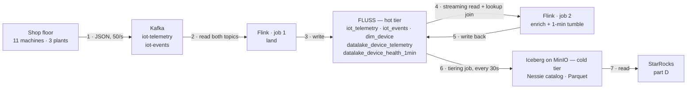
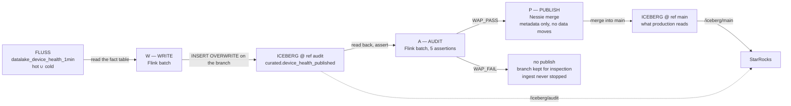

# Experiments

Run this, expect that. The *why* is in [EXPLANATION.md](EXPLANATION.md); the stack and repo
layout are in the [README](../README.md).

Two experiments, one per claim:

| | Claim | Parts |
|---|---|---|
| **1 — the pipeline, hot and cold** | the same table answers *now* from the hot tier while the Iceberg copy is still a flush behind — and the cold copy is plain Iceberg anyone can read | A produce · B pipeline · C query hot vs cold · D StarRocks |
| **2 — offsets vs an index** | Kafka answers a point question by scanning every offset; Fluss answers it with a primary-key lookup | load · bench |
| **3 — the catalog is a git repo** | a curated table can be written, checked and published on a branch, so bad data never reaches `main` — and ingest never stops | write · audit · publish |

Experiment 0 below is just the bring-up gate. Experiment 1's parts run in order; Experiment 2 is
standalone; Experiment 3 needs Experiment 1 running. Each part states what you run, what a pass looks like, and what the common failures
mean.

Every Flink SQL session starts with `sql/common/catalog.sql` — the SQL client has no INCLUDE, so
you paste it first interactively, and `demo.sh` / `bench.sh` concatenate it onto the file they
run.

## Experiment 0 — bring the stack up

```bash
make up          # or `make verify` on its own, any time
```

**Pass:** every line ✓, exit 0, ending in `All components up and wired. Safe to build.`

Checks container states, MinIO/Nessie/Flink endpoints, that a TaskManager actually registered
with the JobManager, and that both buckets exist. It is a **liveness gate only** — it does not
assert the Fluss→Iceberg tiering seam, which does not exist until `make tiering`.

**When it fails:**
- *Fluss containers restarting* — expected on first bring-up. They use `restart: on-failure` to
  survive the Nessie boot race; `depends_on` waits for container start, not for Quarkus to be
  serving `:19120`. Give it a minute.

---

## Experiment 1 — the pipeline, and querying hot and cold

**Proves:** a streamhouse answers from the hot tier *now*, while the same table's Iceberg copy is
still a flush behind — and that cold copy is ordinary Iceberg, readable by an engine that has
never heard of Fluss. A Kafka topic can do neither: no index, no table, no second reader.

Four parts, in order: **A** put sensor data on Kafka, **B** land it in Fluss and tier it,
**C** query hot vs cold, **D** read the cold tier from StarRocks.

### Part A — put sensor data on Kafka

```bash
make produce                      # scripts/iot_producer.py in a container
```

A `confluent-kafka` device fleet: 50 readings/s for 200k readings (~66 min), plus ~5 events/s.
`RATE=200 ROWS=0 make produce` to override; `docker compose logs -f iot-producer` to watch it.

It publishes JSON to `iot-telemetry` and `iot-events`, keyed by `device_id` and shaped exactly
like a real device fleet would send it:

```json
{"reading_id":19974442,"device_id":"device_9","event_time":"2026-09-09T19:21:03.81",
 "energy_usage":1.19,"temperature":22.6,"vibration":0.9,"signal_strength":70}

{"device_id":"device_11","event_time":"2026-09-09T19:21:03.032","severity":"low",
 "event_type":"failure","error_code":"ERR1221","component":"bearing","root_cause":"unknown"}
```

Events are a **sparse union**: only the fields belonging to a row's `event_type` are present —
Flink's JSON format reads a missing field as NULL, which is what `iot_events` expects (failures carry `error_code`/`component`/`root_cause`, maintenance carries
`technician`/`duration_min`/`parts_replaced`, inspections carry `status`/`next_inspection_days`).
Type mix is 10% failure / 30% maintenance / 60% inspection.

Check it landed:

```bash
docker compose exec kafka /opt/kafka/bin/kafka-console-consumer.sh \
  --bootstrap-server kafka:9092 --topic iot-telemetry --from-beginning --max-messages 2
```

**Swapping in your own producer:** the topics, the field names and the JSON encoding are the
whole contract — nothing downstream knows `iot_producer.py` is behind them. Point any producer
at the same two topics and Step 2 is unchanged. Keep timestamps ISO-8601
(`datetime.isoformat()` already is).

`python3 scripts/iot_producer.py --selftest` checks the row shapes without needing a broker.

### Part B — land it in Fluss and tier it

```bash
make sql                          # paste sql/common/catalog.sql, then sql/exp1-pipeline.sql
make tiering                      # then start moving hot -> cold
```



Steps 4 and 5 are the loop that matters: Flink reads `iot_telemetry` **as a stream while job 1 is
still writing it**, joins each reading against `dim_device` with a point lookup, and writes the
two derived tables straight back into the same store. Every table named in the Fluss box is
queryable throughout — that is what a topic cannot do, and it is why step 6 is a *copy*, not a
handover.

**`tiered` means copied, not moved.** A tiered table lives in *both* boxes at once: the Fluss log
has everything including the last few seconds, Iceberg has everything up to the last flush. A
`SELECT` against the bare name reads both; `$lake` reads only the Iceberg side; the difference is
the rows too new to have been flushed. `iot_telemetry` and `dim_device` are untiered — they exist
only in Fluss and have no `$lake` at all. The lake copy earns its keep later, when Fluss ages old
log segments out under its retention and the union read starts serving that older range from
Iceberg instead.

What `sql/exp1-pipeline.sql` creates — "Tiered" = has an Iceberg twin, *in addition to* living in
Fluss:

| Table | Kind | Tiered | Role |
|---|---|---|---|
| `dim_device` | **PK** on `device_id` | no | 11 devices with per-device temperature thresholds; the lookup-join build side |
| `iot_telemetry` | log | no | raw readings off `iot-telemetry`, 50/s |
| `iot_events` | log | **yes** | off `iot-events`; the sparse type-specific columns land as-is |
| `datalake_device_telemetry` | log | **yes** | every reading, enriched with its device's threshold + `anomaly_flag` + `vibration_spike` |
| `datalake_device_health_1min` | log | **yes** | the fact table: 1-minute windows per device — reading count, anomaly count, avg/min/max temp |

The pipeline is **two** detached Flink jobs, not four: each `EXECUTE STATEMENT SET` compiles into
a single job with two sinks, which is why the Flink UI shows names like
`insert-into_...datalake_device_telemetry,fluss_catalog...`. Job 1 lands both topics; job 2 does
the **lookup join** — one point lookup against `dim_device` per incoming reading — and fans the
enriched stream into the per-reading table and the windowed aggregate.

Thresholds are spread 24.0–29.0 °C across the eleven devices while the producer draws
temperature uniformly from 18–30 °C, so each device sits over its own threshold a different and
predictable fraction of the time. That is what makes part D's ranking mean something.

**Pass:**
- the `dim_device` seed job shows **FINISHED** in the Flink UI ([`:8083`](http://localhost:8083))
- 2 jobs **RUNNING** alongside it (one per statement set), plus the tiering job after
  `make tiering`
- within seconds:
  ```sql
  SET 'execution.runtime-mode' = 'batch';
  SELECT count(*) FROM datalake_device_telemetry;         -- non-zero and climbing
  SELECT count(*) FROM datalake_device_telemetry WHERE anomaly_flag;   -- also non-zero
  ```
- `temp_threshold`, `location_id` and `model` are populated — the lookup join is resolving
- after ~1 minute, `SELECT count(*) FROM datalake_device_health_1min` becomes non-zero

**When it fails:**
- *`Table fluss.<name> already exists` right after a `DROP TABLE`* — dropping a tiered table
  leaves an orphan in Nessie. See [Troubleshooting](#troubleshooting--reset).
- *`Table sink ... doesn't support consuming update and delete changes`* — a PK table is feeding
  an append-only sink, or the window emitted a changelog. Everything downstream of
  `iot_telemetry` must be append-only.
  [Why](EXPLANATION.md#a-log-table-sink-cannot-consume-a-pk-tables-changelog).
- *`temp_threshold` all NULL* — the `dim_device` seed did not finish before the derive jobs
  started. `sql/exp1-pipeline.sql` uses `SET 'table.dml-sync' = 'true'` around the seed to
  prevent exactly this; if you pasted statements out of order, re-run the seed.
- *every `event_time` is NULL, everything else populated* — a JSON timestamp-format mismatch.
  Python's `datetime.isoformat()` writes `2026-09-09T19:21:03.81` with a `T`; Flink's JSON
  format defaults to `SQL`, which wants a space, and yields NULL rather than an error.
  `sql/exp1-pipeline.sql` sets `'json.timestamp-format.standard' = 'ISO-8601'`; keep it if you
  swap the producer.
- *zero rows in `iot_telemetry`, jobs RUNNING* — nothing is on the topic. Run Step 1 first, or
  check `make verify` shows Kafka green.
- *`datalake_device_health_1min` stays empty past 2 minutes* — check the second derive job's
  *Exceptions* tab in the Flink UI.

---

### Part C — query hot and cold on the go

Same table, same SQL, two read paths — the bare table unions hot + cold, the `$lake` suffix
reads cold only. This is the freshness claim, made visible.

#### Live, in an interactive session

```bash
make sql                          # paste sql/common/catalog.sql, then sql/exp1-live.sql
```

Section A runs in **streaming** mode with `result-mode = table`: a feed of readings over
threshold or with a vibration spike, and a rolling per-device rollup, both updating in place and
read straight off the tiered table. Section B flips to
batch and puts the three read paths side by side — `t`, `t$lake`, `t$lake$snapshots`.

`sql-client.sh -f` cannot render an updating view, so these only work interactively. Concurrent
sessions are fine — `make sql` runs a throwaway container each time.

#### The contrast, on a loop

```bash
make demo                         # `make demo N=12` for more iterations
```

`make demo` loops `sql/exp1-contrast.sql` (prepending `sql/common/catalog.sql`) and prints:

```
+---------------+-----------+------------------+
| hot_plus_cold | cold_only | rows_only_in_hot |
+---------------+-----------+------------------+
|         14700 |     14100 |              600 |
+---------------+-----------+------------------+

+-----------------------+-------------------+
| windows_hot_plus_cold | windows_cold_only |
+-----------------------+-------------------+
|                    44 |                33 |
+-----------------------+-------------------+

+---------------------+-----------+-------------+--------------+
| reading_only_in_hot | device_id | temperature | anomaly_flag |
+---------------------+-----------+-------------+--------------+
|             1064674 | device_5  |        18.7 |        FALSE |
|             7281523 | device_8  |        27.6 |         TRUE |
|            17267460 | device_11 |        18.3 |        FALSE |
+---------------------+-----------+-------------+--------------+

+-----------+-----------+------------+------------+
| device_id | anomalies | worst_temp | vib_spikes |
+-----------+-----------+------------+------------+
| device_1  |       711 |       30.0 |         37 |
| device_2  |       643 |       30.0 |         43 |
| device_3  |       583 |       30.0 |         15 |
+-----------+-----------+------------+------------+
```

`device_1` leading is not luck: its threshold is 24.0 °C, the lowest of the eleven. The last
query is proof the lookup join resolved a per-device threshold for every reading.

**Pass:** `rows_only_in_hot` > 0 on every iteration, `cold_only` advancing in visible ~30 s
steps (`table.datalake.freshness`), and the anti-join naming actual readings — rows you can
query in the streamhouse right now that are *not on the Iceberg path yet*.

The fact-table row behaves differently and that is worth understanding: windows only close once
a minute, while tiering flushes every 30 s, so `windows_hot_plus_cold` and `windows_cold_only`
are often **equal** — the lake has caught up because nothing new has been produced since the
last flush. Watch it across several iterations and you will see it jump by ~11 (one row per
device) and then be absorbed. A per-reading stream shows a permanent gap; a windowed aggregate
shows a sawtooth.

The second query is an **anti-join against `$lake`**, not `max(reading_id)` —
[why](EXPLANATION.md#why-the-anti-join-not-max).

#### The sharper version: kill the tiering job

Cancel the tiering job in the Flink UI, then re-run `make demo`. `cold_only` **freezes** while
`hot_plus_cold` keeps climbing — the lake tier is now visibly a stale copy while the hot tier
serves. `make tiering` restarts it and the cold number catches up in one jump.

**When it fails:**
- *`cold_only` stuck at 0* — the tiering job is not running or crashed. Check the Flink UI and
  `make logs`.
- *`Batch mode can only be supported if one lake snapshot exists`* — nothing has been tiered
  yet. The bare table is not readable in batch at all until the first flush; wait ~30 s after
  `make tiering`, or check `<table>$lake` first.
- *`lake records must instance of sorted view`* — a tiered table has a PRIMARY KEY.
  [Why that is fatal](EXPLANATION.md#union-read-requires-log-tables).
- *`Trying to access closed classloader`* — Hadoop's static `FileSystem` cache pins the user
  classloader and Flink's leak check trips intermittently on repeated SQL sessions. Disabled via
  `classloader.check-leaked-classloader: false` in `docker-compose.yml`; if you see it again,
  that setting did not reach the service that threw.
- *numbers identical between iterations, or `rows_only_in_hot` = 0* — the producer finished.
  It is bounded by `ROWS` (200,000 readings at 50/s ≈ 66 min). Once it stops, tiering catches up
  completely and the gap closes — correct behaviour, but no longer a contrast. Run `make demo`
  **while `make produce` is still running**, or restart it (`ROWS=0` for unbounded).

---

### Part D — StarRocks reads the cold tier only

The cold tier is just Iceberg. An OLAP engine reads it with Fluss nowhere in the path — no
connector, no coordination, no awareness that Fluss exists. It sees strictly less than part C's
union read, which is the point: same data, one tier behind.

```bash
make starrocks                    # wait for the healthcheck (~1-2 min)
make sr-sql                       # paste sql/exp1-starrocks.sql
```

`sr-sql` uses the host's `mysql` client when there is one and the container's otherwise. To run
the whole file without pasting:

```bash
docker compose -f docker-compose.yml -f docker-compose.starrocks.yml exec -T starrocks \
  mysql -h 127.0.0.1 -P 9030 -u root < sql/exp1-starrocks.sql
```

`sql/exp1-starrocks.sql` registers an external Iceberg catalog over Nessie, then runs the dashboard queries:
temperature vs each device's threshold, events by type and severity, and devices ranked by
anomalous windows.

**Pass:** `SHOW DATABASES FROM iceberg_nessie` lists the `fluss` database, and the third panel
ranks devices by how much time they spend over their own threshold — which comes out **ordered
by threshold**, because that is the only thing that differs between them:

```
device_id  threshold  windows  anomalous_readings  pct_over_threshold  vibration_spikes
device_1        24.0        5                 819                50.2                71
device_2        24.5        5                 752                46.2                91
device_3        25.0        5                 667                41.3                55
...
device_10       28.5        5                 208                12.9                65
device_11       29.0        5                 111                 7.1                67
```

That monotonic fall from 50.2% to 7.1% is the end-to-end proof, and it matches theory: with
temperature drawn uniformly from 18–30 °C, a device with a 24.0 °C threshold should sit over it
50% of the time and one at 29.0 °C about 8%. StarRocks is reading a fact table whose per-device
thresholds were resolved by a lookup join in Flink, tiered to Iceberg, and it never touched
Fluss on the way out.

Panel 2b is the other half of the point: `root_cause` and `component` are populated only on
`failure` rows, and that sparseness survives producer → Kafka JSON → Fluss → Iceberg →
StarRocks intact.

Then the freshness half:

```sql
SELECT count(*) FROM datalake_device_telemetry;
```

returns a value **below** the `hot_plus_cold` number from part C — 17,100 against a union read
already past 19,000 on the run these numbers came from. That gap is the whole point: StarRocks
sees only what tiering has flushed. It is reading Parquet out of MinIO through a Nessie
catalog — exactly what any Iceberg-aware engine would do.

**When it fails:**
- *Catalog registers but no databases* — nothing has been tiered yet. Run parts A-B and
  `make tiering` first.
- *FE not healthy* — StarRocks `allin1` is memory-hungry; check Docker's allocation.
- *`mysql: command not found`* — `make sr-sql` falls back to the container's client, so this
  only happens if you typed `mysql` yourself.
- *`Catalog 'iceberg_nessie' already exists`* — you should not see this; the file uses
  `IF NOT EXISTS` so it is safe to re-run. If you edited it out, `DROP CATALOG iceberg_nessie`.
- *every device shows the same anomaly rate* — the panel is reading `anomaly_flag` rather than
  `cnt_anomalies`. Over a full minute the max reading almost always clears the threshold, so the
  flag saturates; rank on the rate.
- *`Location does not exist: s3://warehouse/...`* — StarRocks is serving cached Iceberg metadata
  for files a reset deleted. `make down` now tears StarRocks down along with everything else; if
  you reset some other way, run
  `REFRESH EXTERNAL TABLE iceberg_nessie.fluss.<table>;` for each table.

---

## Experiment 2 — offsets vs an index: why not just Kafka?

**Proves:** the queryability claim. A Kafka topic and a Fluss table hold the same volume of
records over the same key space. Asking one question of each costs wildly different amounts.

This one is standalone — it uses its own topic and its own Fluss table, and does not touch
Experiment 1's pipeline. Same producer, same row shape, just bulk: one topic, no events, and a 2M-wide key
space so a given `reading_id` exists and repeats.

Note this is not an argument for deleting Kafka: Experiment 1 *ingests from* Kafka. The claim is
narrower and it is about where you answer questions. A topic is a good bus and a bad index.

```bash
make bench-load   # starts bench-producer + submits the Flink load job, then returns
                  # wait ~100 s
make bench        # run it two or three times, a minute apart
```

`make bench-load` runs `scripts/iot_producer.py` at 20k/s for 20M readings onto
`bench-telemetry`, and `sql/exp2-bench-load.sql` mirrors that topic into the Fluss PK table
`bench_telemetry`. `make bench` then runs `sql/exp2-bench-query.sql` —
*"what is reading 424242?"* — against each:

```
engine                           state        duration      topic size when run
Fluss (PK point lookup)          FINISHED        291 ms       360k records
Kafka (scan to latest offset)    FINISHED       1670 ms
Fluss (PK point lookup)          FINISHED        426 ms       1.2M records
Kafka (scan to latest offset)    FINISHED       2231 ms
Fluss (PK point lookup)          FINISHED        310 ms       1.9M records
Kafka (scan to latest offset)    FINISHED       2825 ms
Fluss (PK point lookup)          FINISHED        438 ms       2.4M records  (hits: 1 and 1)
Kafka (scan to latest offset)    FINISHED       4148 ms
```

Four runs a minute apart on a laptop. The Fluss leg is flat — 291 / 426 / 310 / 438 ms, all
close to Flink's bare job-startup cost — while the Kafka leg tracks the topic:
1.7 → 2.2 → 2.8 → 4.1 s, deserializing every record to find one. By the last run both engines
return the same answer (`hits` = 1) at a tenfold difference in cost.

**`hits_fluss` and `hits_kafka` are 0 early on, and that is fine.** `reading_id` is drawn
uniformly from a 2M key space, so 424242 does not exist until roughly that many rows have been
produced. The benchmark measures what the *question* costs, not whether it found anything —
a `count(*)` scan costs the same either way.

**And once they are non-zero they usually differ** — `hits_fluss` is capped at 1 because the PK
table keeps one row per `reading_id`, while the topic keeps every copy, so `hits_kafka` rises
with `rows / ID_MAX`. That is the same argument from the other side: a log accumulates copies,
an indexed table holds state. A later run here, with 7.4M records on the topic: 424 ms / 1 hit
against 24.9 s / 2 hits.

**Pass:** run `make bench` two or three times, a minute apart, **while `make bench-load` is
still loading**. The Fluss row stays flat while the Kafka row grows with the topic. That
divergence is the whole argument — absolute numbers are laptop-bound and not interesting.

Bench a *drained* topic and both numbers just sit still: there is nothing left to grow. The 20M
row count exists to give you a window wide enough to see it.

- **Fluss** has a primary-key index. A full-PK predicate is a point lookup, and its cost does
  not move as the table grows.
- **Kafka** has offsets, not indexes. Flink deserializes every record from earliest to latest
  offset (`scan.bounded.mode`), so cost is linear in retention. Kafka + Iceberg gets you a
  queryable copy only by *making a second copy*.

`bench_telemetry` is a PK table but is **not** tiered —
[why](EXPLANATION.md#why-bench_telemetry-is-not-tiered).

Timings are Flink job durations pulled from the REST API, not wall clock: `docker compose run`
costs several seconds of container startup that would swamp everything being measured.

**When it fails:**
- *the Kafka duration does not grow* — the producer is not running. `docker compose logs
  bench-producer`, and check the load job in the Flink UI.
- *both durations flat across runs* — the producer finished (20M rows). Restart it with a
  bigger `BENCH_ROWS`, or reset.
- *the producer cannot hold 20k/s* — expected on a small machine; single-threaded JSON caps out
  somewhere above that. The topic simply grows more slowly, and the divergence still shows.

Since Experiment 1 also ingests from Kafka, `verify.sh` gates on the broker like any other core
service.

---

## Experiment 3 — write-audit-publish on a Nessie branch

**Proves:** the cold tier is *versioned*. A curated table is written to a branch, checked there,
and merged into `main` only if it passes — so consumers of `main` never see a bad publish, and
the streaming side is never in the loop. This is the alternative to staging bronze/silver/gold
copies of the same rows: one table, one commit, gated.

```bash
make wap          # write → audit → merge
make wap-break    # same, with one corrupt row injected
```



**Where each step actually happens:**

| Step | Engine | What it touches |
|---|---|---|
| W — write | **Flink**, batch | reads a **Fluss** table (hot ∪ cold), writes an **Iceberg** table on branch `audit` |
| A — audit | **Flink**, batch | reads only the Iceberg table on `audit` |
| P — publish | **Nessie**, an HTTP call | moves a ref. No engine, no data, no rewrite |
| the proof | **StarRocks** | one catalog per ref: `/iceberg/main` vs `/iceberg/audit` |

The curated table is **Iceberg only** — it has no Fluss counterpart, is never tiered, and Fluss
never learns it exists. Fluss is the *source*; the whole WAP cycle lives in the lake. That is
also why a failed audit cannot disturb ingest: nothing in the loop writes to Fluss or Kafka.

`scripts/wap.py` is the orchestrator — stdlib only, Nessie over HTTP. The three SQL files are the
work: `sql/exp3-publish.sql` (the same Iceberg catalog as tiering, with `'ref' = 'audit'`),
`sql/exp3-audit.sql` (the checks, emitting `WAP_PASS` / `WAP_FAIL`), and `sql/exp3-poison.sql`
(the deliberate defect for `wap-break`).

**Pass — `make wap`:**

```
─── A audit the branch ───
| rows_published | null_keys | impossible_counts | temp_out_of_range | unenriched |  verdict |
|             66 |         0 |                 0 |                 0 |          0 | WAP_PASS |

─── P publish — merge into main, or do not ───
✓ audit passed, merged. wasSuccessful=True
  branch point   0e2036076e71
  main was       cf381b712e85   (tiering moved it meanwhile)
  main now       fbe566f7ebe0
```

Note *"main was"* ≠ *"branch point"*: the tiering job committed to `main` during the cycle and the
merge still applied. Nessie merges per table — the branch only touched `curated.*`, tiering only
touches `fluss.*`, so there is nothing to conflict over. That is what makes this safe to run
against a live stream.

**Pass — `make wap-break`:** exits 1, and the last lines are the whole argument:

```
✗ audit FAILED. audit keeps the bad data and main never saw it:
  main  @ 0e2036076e71   ['curated', ..., 'fluss.iot_events']
```

The producer and all the Flink jobs are still running while that happens. A failed quality gate
is an unmerged branch and an alert, not an outage.

**See it from the consumer's side.** With the StarRocks overlay up (`make starrocks`), register a
second catalog on the branch and read the same table name on both refs:

```bash
make sr-sql                       # paste sql/exp3-starrocks-branches.sql
```

Straight after `make wap-break`:

```
rows_on_main    impossible_rows
22              0                 ← production: the last publish that passed

rows_on_audit   impossible_rows
34              1                 ← the candidate, quarantined on the branch

device_id  cnt_points  cnt_anomalies  avg_temperature  model
device_99  10          9999           812.5            NULL
```

Same SQL, same table name, two refs — one catalog property apart. The bad row is readable, so it
can be diagnosed, and it is nowhere near what anybody queries.

**When it fails:**
- *`Named reference 'audit' not found`* — a previous run was interrupted between delete and
  create. Re-run; `wap.py` recreates the branch each time.
- *`rows_published` = 0* — `datalake_device_health_1min` is empty. The 1-minute windows need a
  minute of data and a lake snapshot; run `make tiering` and wait.
- *audit passes when it should fail* — check `read_verdict()` in `wap.py`, not the SQL: the
  client echoes the script, so both verdict literals are always somewhere in the output.
  `python3 scripts/wap.py --selftest` covers exactly that trap.

**What this replaces:** medallion staging. Bronze/silver/gold makes a physical copy per layer and
still needs a way to stop a bad gold table from being read. Here the "layer" is a branch — a few
bytes of metadata, no data movement — and the gate is a merge that either happens or does not.

---

## Troubleshooting & reset

**`sql/exp1-pipeline.sql` errors on a re-run.** The Fluss catalog ignores
`CREATE TABLE IF NOT EXISTS` — it still errors if the table exists. `DROP TABLE` the ones you
need, or do a full reset.

**`Table fluss.<name> already exists` right after a successful `DROP TABLE`.** Dropping a
datalake-enabled Fluss table removes it from Fluss but **leaves the Iceberg table registered in
Nessie**, and the recreate fails on that orphan. `SHOW TABLES` in `fluss_catalog` will not list
it; the Iceberg catalog will. The recipe for dropping it there is in
[`EXPLANATION.md`](EXPLANATION.md#dropping-a-tiered-table-leaves-an-orphan-in-nessie).

**Full reset is `make down`** (`docker compose down -v`). This is the *correct* reset, not a
heavy one: it drops both volumes together, so the Nessie catalog and the MinIO files cannot
outlive each other — a half-reset leaves orphaned Iceberg data files or catalog entries pointing
at files that are gone. It also tears down the StarRocks overlay (which otherwise survives with a stale
Iceberg metadata cache) and both producer profiles (compose ignores containers whose profile is
not named, so they would otherwise keep producing against a dead broker). Then start again from `make produce`. `make clean` additionally deletes `lib/*.jar`, which
`make up` re-fetches.

**Fluss containers restart a couple of times on first bring-up.** Expected — the Nessie boot
race. See Experiment 0.

**Concurrent SQL sessions are fine.** `make sql` runs a throwaway container each time.

**Numbers frozen, no errors.** The producer finished. Check
[why the producers are bounded](EXPLANATION.md#why-the-producers-are-bounded-and-what-drains).

**Where to look when a job misbehaves:** Flink UI [`:8083`](http://localhost:8083) for job state
and exceptions, `make logs` for the Fluss servers, `docker compose logs <svc>` for everything
else.
