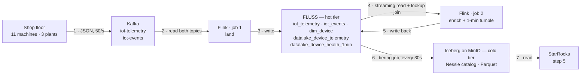

# Tutorial — an IoT pipeline on the streamhouse pattern

Run this, expect that. The stack and repo layout are in the [README](../README.md).

**What you build:** a real-time IoT pipeline where every stage is a *table*, not job state.
Sensor readings arrive on Kafka, Flink lands them in Fluss (the hot tier), enriches each reading
against its device's own threshold, rolls them into 1-minute windows — and Fluss tiers every one
of those tables into Iceberg on MinIO by itself. The same table name answers a sub-second
operational question from the hot tier and serves a batch engine from the cold one.

| Step | Command | What it does |
|---|---|---|
| 0 | `make up` | bring the stack up, gate on liveness |
| 1 | `make produce` | sensor data onto Kafka |
| 2 | `make sql` → `sql/01-pipeline.sql` | land it in Fluss, enrich, window |
| 3 | `make tiering` | start moving hot → cold |
| 4 | `sql/02-live.sql`, `make demo` | query hot vs cold |
| 5 | `make starrocks` → `sql/04-starrocks.sql` | read the cold tier as plain Iceberg |

Steps run in order. Each states what you run, what a pass looks like, and what the common
failures mean.

Every Flink SQL session starts with `sql/catalog.sql` — the SQL client has no INCLUDE, so you
paste it first interactively, and `demo.sh` concatenates it onto the file it runs.

## Step 0 — bring the stack up

```bash
make up          # or `make verify` on its own, any time
```

**Pass:** every line ✓, exit 0, ending in `All components up and wired. Safe to build.`

Checks container states, MinIO/Nessie/Flink endpoints, that a TaskManager actually registered
with the JobManager, and that both buckets exist. It is a **liveness gate only** — it does not
assert the Fluss→Iceberg tiering seam, which does not exist until step 3.

**When it fails:**
- *Fluss containers restarting* — expected on first bring-up. They use `restart: on-failure` to
  survive the Nessie boot race; `depends_on` waits for container start, not for Quarkus to be
  serving `:19120`. Give it a minute.

---

## Step 1 — put sensor data on Kafka

```bash
make produce                      # scripts/iot_producer.py in a container
```

A `confluent-kafka` device fleet: 50 readings/s for 200k readings (~66 min), plus ~5 events/s.
`RATE=200 ROWS=0 make produce` to override; `docker compose logs -f iot-producer` to watch it.

It publishes JSON to `iot-telemetry` and `iot-events`, keyed by `device_id` and shaped exactly
like a real device fleet would send it:

```json
{"reading_id":19974442,"device_id":"device_9","event_time":"2026-09-09T19:21:03.81",
 "energy_usage":1.19,"temperature":22.6,"vibration":0.9,"signal_strength":70}

{"device_id":"device_11","event_time":"2026-09-09T19:21:03.032","severity":"low",
 "event_type":"failure","error_code":"ERR1221","component":"bearing","root_cause":"unknown"}
```

Events are a **sparse union**: beyond `device_id` / `event_time` / `severity`, only the fields
belonging to a row's `event_type` are present — Flink's JSON format reads a missing field as
NULL, which is what `iot_events` expects (failures carry `error_code`/`component`/`root_cause`,
maintenance carries `technician`/`duration_min`/`parts_replaced`, inspections carry
`status`/`next_inspection_days`). Type mix is 10% failure / 30% maintenance / 60% inspection.

Check it landed:

```bash
docker compose exec kafka /opt/kafka/bin/kafka-console-consumer.sh \
  --bootstrap-server kafka:9092 --topic iot-telemetry --from-beginning --max-messages 2
```

**Swapping in your own producer:** the topics, the field names and the JSON encoding are the
whole contract — nothing downstream knows `iot_producer.py` is behind them. Point any producer
at the same two topics and step 2 is unchanged. Keep timestamps ISO-8601
(`datetime.isoformat()` already is).

`python3 scripts/iot_producer.py --selftest` checks the row shapes without needing a broker.

---

## Step 2 — land it in Fluss, enrich, window

```bash
make sql                          # paste sql/catalog.sql, then sql/01-pipeline.sql
```



Steps 4 and 5 are the loop that matters: Flink reads `iot_telemetry` **as a stream while job 1 is
still writing it**, joins each reading against `dim_device` with a point lookup, and writes the
two derived tables straight back into the same store. Every table named in the Fluss box is
queryable throughout — that is what a topic cannot do, and it is why step 6 is a *copy*, not a
handover.

**`tiered` means copied, not moved.** A tiered table lives in *both* boxes at once: the Fluss log
has everything including the last few seconds, Iceberg has everything up to the last flush. A
`SELECT` against the bare name reads both; `$lake` reads only the Iceberg side; the difference is
the rows too new to have been flushed. `dim_device` is untiered — it exists only in Fluss and has
no `$lake` at all. The lake copy earns its keep later, when Fluss ages old log segments out under
its retention and the union read starts serving that older range from Iceberg instead.

What `sql/01-pipeline.sql` creates — "Tiered" = has an Iceberg twin, *in addition to* living in
Fluss:

| Table | Kind | Tiered | Role |
|---|---|---|---|
| `dim_device` | **PK** on `device_id` | no | 11 devices with per-device temperature thresholds; the lookup-join build side |
| `iot_telemetry` | log | **yes** | raw readings off `iot-telemetry`, 50/s |
| `iot_events` | log | **yes** | off `iot-events`; the sparse type-specific columns land as-is |
| `datalake_device_telemetry` | log | **yes** | every reading, enriched with its device's threshold + `anomaly_flag` + `vibration_spike` |
| `datalake_device_health_1min` | log | **yes** | the fact table: 1-minute windows per device — reading count, anomaly count, avg/min/max temp |

The pipeline is **two** detached Flink jobs, not four: each `EXECUTE STATEMENT SET` compiles into
a single job with two sinks, which is why the Flink UI shows names like
`insert-into_...datalake_device_telemetry,fluss_catalog...`. Job 1 lands both topics; job 2 does
the **lookup join** — one point lookup against `dim_device` per incoming reading — and fans the
enriched stream into the per-reading table and the windowed aggregate.

Thresholds are spread 24.0–29.0 °C across the eleven devices while the producer draws
temperature uniformly from 18–30 °C, so each device sits over its own threshold a different and
predictable fraction of the time. That is what makes step 5's ranking mean something.

**Pass:**
- the `dim_device` seed job shows **FINISHED** in the Flink UI ([`:8083`](http://localhost:8083))
- 2 jobs **RUNNING** alongside it (one per statement set)
- within seconds:
  ```sql
  SET 'execution.runtime-mode' = 'batch';
  SELECT count(*) FROM datalake_device_telemetry;         -- non-zero and climbing
  SELECT count(*) FROM datalake_device_telemetry WHERE anomaly_flag;   -- also non-zero
  ```
- `temp_threshold`, `location_id` and `model` are populated — the lookup join is resolving
- after ~1 minute, `SELECT count(*) FROM datalake_device_health_1min` becomes non-zero

**When it fails:**
- *`Table fluss.<name> already exists` right after a `DROP TABLE`* — dropping a tiered table
  leaves an orphan in Nessie. See [Troubleshooting](#troubleshooting--reset).
- *`Table sink ... doesn't support consuming update and delete changes`* — a PK table is feeding
  an append-only sink, or the window emitted a changelog. Everything downstream of
  `iot_telemetry` must be append-only.
  [Why](#a-log-table-sink-cannot-consume-a-pk-tables-changelog).
- *`temp_threshold` all NULL* — the `dim_device` seed did not finish before the derive jobs
  started. `sql/01-pipeline.sql` uses `SET 'table.dml-sync' = 'true'` around the seed to
  prevent exactly this; if you pasted statements out of order, re-run the seed.
- *every `event_time` is NULL, everything else populated* — a JSON timestamp-format mismatch.
  [Why](#json-timestamps-on-kafka-need-iso-8601).
- *zero rows in `iot_telemetry`, jobs RUNNING* — nothing is on the topic. Run step 1 first, or
  check `make verify` shows Kafka green.
- *`datalake_device_health_1min` stays empty past 2 minutes* — check the second derive job's
  *Exceptions* tab in the Flink UI.

---

## Step 3 — turn on tiering

```bash
make tiering
```

The Fluss Lakehouse Tiering Service — a long-running Flink job, not a compose service. It reads
the Fluss log of every datalake-enabled table and, every `table.datalake.freshness` (30 s here),
writes Parquet under `s3://warehouse/fluss/<name>/` and commits one Iceberg snapshot per flush
through Nessie.

**Pass:** a third job RUNNING in the Flink UI, and within ~30 s:

```sql
SELECT count(*) FROM datalake_device_telemetry$lake;       -- non-zero
SELECT * FROM datalake_device_telemetry$lake$snapshots;    -- one row per flush
```

Note the ordering: the Iceberg tables appeared in Nessie back at `CREATE TABLE`, not here —
[see the seam](#when-the-iceberg-table-actually-appears-in-nessie). An empty `$lake` with a live
Nessie entry is normal before this step, not a failure.

---

## Step 4 — query hot and cold on the go

Same table, same SQL, two read paths — the bare table unions hot + cold, the `$lake` suffix
reads cold only. This is the freshness claim, made visible.

### Live, in an interactive session

```bash
make sql                          # paste sql/catalog.sql, then sql/02-live.sql
```

Section A runs in **streaming** mode with `result-mode = table`: a feed of readings over
threshold or with a vibration spike, and a rolling per-device rollup, both updating in place and
read straight off the tiered table. Section B flips to batch and puts the three read paths side
by side — `t`, `t$lake`, `t$lake$snapshots`.

`sql-client.sh -f` cannot render an updating view, so these only work interactively. Concurrent
sessions are fine — `make sql` runs a throwaway container each time.

### The contrast, on a loop

```bash
make demo                         # `make demo N=12` for more iterations
```

`make demo` loops `sql/03-contrast.sql` (prepending `sql/catalog.sql`) and prints:

```
+---------------+-----------+------------------+
| hot_plus_cold | cold_only | rows_only_in_hot |
+---------------+-----------+------------------+
|         14700 |     14100 |              600 |
+---------------+-----------+------------------+

+-----------------------+-------------------+
| windows_hot_plus_cold | windows_cold_only |
+-----------------------+-------------------+
|                    44 |                33 |
+-----------------------+-------------------+

+---------------------+-----------+-------------+--------------+
| reading_only_in_hot | device_id | temperature | anomaly_flag |
+---------------------+-----------+-------------+--------------+
|             1064674 | device_5  |        18.7 |        FALSE |
|             7281523 | device_8  |        27.6 |         TRUE |
|            17267460 | device_11 |        18.3 |        FALSE |
+---------------------+-----------+-------------+--------------+

+-----------+-----------+------------+------------+
| device_id | anomalies | worst_temp | vib_spikes |
+-----------+-----------+------------+------------+
| device_1  |       711 |       30.0 |         37 |
| device_2  |       643 |       30.0 |         43 |
| device_3  |       583 |       30.0 |         15 |
+-----------+-----------+------------+------------+
```

`device_1` leading is not luck: its threshold is 24.0 °C, the lowest of the eleven. The last
query is proof the lookup join resolved a per-device threshold for every reading.

**Pass:** `rows_only_in_hot` > 0 on every iteration, `cold_only` advancing in visible ~30 s
steps (`table.datalake.freshness`), and the anti-join naming actual readings — rows you can
query in the streamhouse right now that are *not on the Iceberg path yet*.

The fact-table row behaves differently and that is worth understanding: windows only close once
a minute, while tiering flushes every 30 s, so `windows_hot_plus_cold` and `windows_cold_only`
are often **equal** — the lake has caught up because nothing new has been produced since the
last flush. Watch it across several iterations and you will see it jump by ~11 (one row per
device) and then be absorbed. A per-reading stream shows a permanent gap; a windowed aggregate
shows a sawtooth.

The second query is an **anti-join against `$lake`**, not `max(reading_id)` —
[why](#why-the-anti-join-not-max).

### The sharper version: kill the tiering job

Cancel the tiering job in the Flink UI, then re-run `make demo`. `cold_only` **freezes** while
`hot_plus_cold` keeps climbing — the lake tier is now visibly a stale copy while the hot tier
serves. `make tiering` restarts it and the cold number catches up in one jump.

**When it fails:**
- *`cold_only` stuck at 0* — the tiering job is not running or crashed. Check the Flink UI and
  `make logs`.
- *`Batch mode can only be supported if one lake snapshot exists`* — nothing has been tiered
  yet. The bare table is not readable in batch at all until the first flush; wait ~30 s after
  `make tiering`, or check `<table>$lake` first.
- *`lake records must instance of sorted view`* — a tiered table has a PRIMARY KEY.
  [Why that is fatal](#union-read-requires-log-tables).
- *`Trying to access closed classloader`* — Hadoop's static `FileSystem` cache pins the user
  classloader and Flink's leak check trips intermittently on repeated SQL sessions. Disabled via
  `classloader.check-leaked-classloader: false` in `docker-compose.yml`; if you see it again,
  that setting did not reach the service that threw.
- *numbers identical between iterations, or `rows_only_in_hot` = 0* — the producer finished.
  It is bounded by `ROWS` (200,000 readings at 50/s ≈ 66 min). Once it stops, tiering catches up
  completely and the gap closes — correct behaviour, but no longer a contrast. Run `make demo`
  **while `make produce` is still running**, or restart it (`ROWS=0` for unbounded).

---

## Step 5 — StarRocks reads the cold tier only

The cold tier is just Iceberg. An OLAP engine reads it with Fluss nowhere in the path — no
connector, no coordination, no awareness that Fluss exists. It sees strictly less than step 4's
union read, which is the point: same data, one tier behind.

```bash
make starrocks                    # wait for the healthcheck (~1-2 min)
make sr-sql                       # paste sql/04-starrocks.sql
```

`sr-sql` uses the host's `mysql` client when there is one and the container's otherwise. To run
the whole file without pasting:

```bash
docker compose -f docker-compose.yml -f docker-compose.starrocks.yml exec -T starrocks \
  mysql -h 127.0.0.1 -P 9030 -u root < sql/04-starrocks.sql
```

`sql/04-starrocks.sql` registers an external Iceberg catalog over Nessie, then runs the dashboard
queries: temperature vs each device's threshold, events by type and severity, and devices ranked
by anomalous windows.

**Pass:** `SHOW DATABASES FROM iceberg_nessie` lists the `fluss` database, and the third panel
ranks devices by how much time they spend over their own threshold — which comes out **ordered
by threshold**, because that is the only thing that differs between them:

```
device_id  threshold  windows  anomalous_readings  pct_over_threshold  vibration_spikes
device_1        24.0        5                 819                50.2                71
device_2        24.5        5                 752                46.2                91
device_3        25.0        5                 667                41.3                55
...
device_10       28.5        5                 208                12.9                65
device_11       29.0        5                 111                 7.1                67
```

That monotonic fall from 50.2% to 7.1% is the end-to-end proof, and it matches theory: with
temperature drawn uniformly from 18–30 °C, a device with a 24.0 °C threshold should sit over it
50% of the time and one at 29.0 °C about 8%. StarRocks is reading a fact table whose per-device
thresholds were resolved by a lookup join in Flink, tiered to Iceberg, and it never touched
Fluss on the way out.

Panel 2b is the other half of the point: `root_cause` and `component` are populated only on
`failure` rows, and that sparseness survives producer → Kafka JSON → Fluss → Iceberg →
StarRocks intact.

Then the freshness half:

```sql
SELECT count(*) FROM datalake_device_telemetry;
```

returns a value **below** the `hot_plus_cold` number from step 4 — 17,100 against a union read
already past 19,000 on the run these numbers came from. That gap is the whole point: StarRocks
sees only what tiering has flushed. It is reading Parquet out of MinIO through a Nessie
catalog — exactly what any Iceberg-aware engine would do.

**When it fails:**
- *Catalog registers but no databases* — nothing has been tiered yet. Run steps 1-3 first.
- *FE not healthy* — StarRocks `allin1` is memory-hungry; check Docker's allocation.
- *`mysql: command not found`* — `make sr-sql` falls back to the container's client, so this
  only happens if you typed `mysql` yourself.
- *`Catalog 'iceberg_nessie' already exists`* — you should not see this; the file uses
  `IF NOT EXISTS` so it is safe to re-run. If you edited it out, `DROP CATALOG iceberg_nessie`.
- *every device shows the same anomaly rate* — the panel is reading `anomaly_flag` rather than
  `cnt_anomalies`. [Why the flag saturates](#why-the-fact-table-counts-anomalies-instead-of-flagging-them).
- *`Location does not exist: s3://warehouse/...`* — [StarRocks caches Iceberg
  metadata](#starrocks-caches-iceberg-metadata).

---

# Why it is built this way

The constraints below are non-obvious, cost real debugging time, and are load-bearing. If you
change a table definition, read these first.

## Hard constraints

### Union read requires log tables

Querying the bare table (hot ∪ cold) merges the lake snapshot with the Fluss log. On a PK table
that merge is a **sort-merge**, so Fluss's `LakeSnapshotAndLogSplitScanner` requires the lake
reader to implement `org.apache.fluss.lake.source.SortedRecordReader`.
`fluss-lake-iceberg-0.9.1-incubating` does not implement it anywhere — verified by unpacking
the jar. The read fails with:

```
java.lang.UnsupportedOperationException: lake records must instance of sorted view.
```

Log tables concatenate rather than merge, so they union-read fine. This is why every tiered
table here — `iot_telemetry`, `iot_events`, `datalake_device_telemetry`,
`datalake_device_health_1min` — has **no primary key**.

Paimon's reader does implement the interface. Iceberg union read on PK tables is a post-0.9
roadmap item.

### A log-table sink cannot consume a PK table's changelog

Reading a PK table in streaming mode emits `-U/+U`, and an append-only sink rejects it:

```
Table sink ... doesn't support consuming update and delete changes
```

So making the tiered table append-only forces its source to be append-only too — `iot_telemetry`
is a log table for this reason. Only `dim_device` stays PK: it is the lookup-join build side,
where the point lookups actually happen and where nothing streams *out*.

This is also why the fact table uses a **processing-time** tumbling window. A proctime tumble
needs no watermark and emits append-only rows; an unbounded `GROUP BY` would emit a changelog
and the sink would reject it.

### Dropping a tiered table leaves an orphan in Nessie

`DROP TABLE` removes the Fluss table but not the Iceberg one, so the recreate fails with
`Table fluss.<name> already exists` even though `SHOW TABLES` does not list it. Drop it through
an Iceberg catalog — the jars are already on the Flink classpath:

```sql
CREATE CATALOG ice WITH (
  'type'='iceberg',
  'catalog-impl'='org.apache.iceberg.nessie.NessieCatalog',
  'uri'='http://nessie:19120/api/v2',
  'ref'='main',
  'warehouse'='s3://warehouse/',
  'io-impl'='org.apache.iceberg.aws.s3.S3FileIO',
  's3.endpoint'='http://minio:9000',
  's3.access-key-id'='admin',
  's3.secret-access-key'='password',
  's3.path-style-access'='true',
  'client.region'='us-east-1'
);
USE CATALOG ice;
SHOW TABLES IN fluss;
DROP TABLE fluss.<name>;
```

Or just `make down`, which is the correct full reset.

### JSON timestamps on Kafka need `ISO-8601`

Python's `datetime.isoformat()` emits `2026-09-09T19:21:03.81` — with a `T`. Flink's JSON format
defaults to `'json.timestamp-format.standard' = 'SQL'`, which expects `2026-09-09 19:21:03.81`
with a space. On a mismatch it does not raise: the column arrives **NULL** and every other field
parses fine, so the pipeline looks healthy and the timestamps are silently gone.

`scripts/iot_producer.py` writes ISO-8601 and `sql/01-pipeline.sql` reads it that way. Keep
both ends aligned if you swap the producer. `'json.ignore-parse-errors' = 'true'` on the consumer
is the related decision: against a real topic one malformed message should not kill the job.

### StarRocks caches Iceberg metadata

An external Iceberg catalog in StarRocks caches manifest locations. Reset MinIO and Nessie
underneath a running StarRocks and it will serve paths whose files no longer exist:

```
Location does not exist: s3://warehouse/fluss/datalake_device_telemetry_<uuid>/metadata/<...>.avro
```

`make down` therefore tears down the StarRocks overlay too — otherwise it survives a
`docker compose down -v` that was issued against the base file alone. To recover without a full
reset: `REFRESH EXTERNAL TABLE iceberg_nessie.fluss.<table>;`.

### The Fluss catalog ignores `CREATE TABLE IF NOT EXISTS`

It still errors if the table exists.

### Use the native Nessie catalog, not Iceberg-REST

`NessieCatalog` against `/api/v2`. Nessie's Iceberg-REST `createTable` NPEs with Fluss 0.9.1's
Iceberg 1.10 client (it drops the deprecated `lastColumnId`). StarRocks still reads via the REST
endpoint — reads are fine, only REST *writes* NPE. That asymmetry is deliberate, not an
oversight.

### Flink is pinned to 1.20

The Fluss connector is built for it. Do not bump to 2.x.

---

## The Fluss ⇄ Nessie ⇄ Iceberg seam

### When the Iceberg table actually appears in Nessie

Two separate moments, and confusing them is what makes tiering look broken:

1. **`CREATE TABLE ... WITH ('table.datalake.enabled' = 'true')`** (step 2) — the Fluss
   **coordinator-server** immediately creates a matching *empty* Iceberg table `fluss.<name>` in
   Nessie, on branch `main`, warehouse `s3://warehouse/`. It does this itself, with the
   `datalake.iceberg.*` settings in `docker-compose.yml` and the `NessieCatalog` jars mounted at
   `/opt/fluss/plugins/iceberg/`. No Flink job is involved; MinIO gets the table's first
   `metadata.json` and **no data files**.
2. **`make tiering`** (step 3) — the tiering service writes Parquet and commits one Iceberg
   snapshot per flush.

So the catalog entry exists from DDL time and the *data* arrives only once tiering runs. That is
why a table can be queryable in Fluss, visible in Nessie, and still empty in `$lake`:

```sql
SELECT count(*) FROM datalake_device_telemetry;            -- hot ∪ cold, answers now
SELECT count(*) FROM datalake_device_telemetry$lake;       -- Iceberg only, as of the last commit
SELECT * FROM datalake_device_telemetry$lake$snapshots;    -- one row per flush
```

Check the catalog side directly, without Flink:

```bash
curl -s localhost:19120/api/v2/trees/main/entries | jq '.entries[].name.elements'
# fluss, fluss.datalake_device_telemetry, fluss.datalake_device_health_1min, fluss.iot_events

docker compose run --rm --entrypoint sh minio-init -c \
  'mc alias set m http://minio:9000 admin password >/dev/null && mc ls -r m/warehouse'
# before tiering: only <table>/metadata/00000-*.metadata.json — no data/ prefix
```

Two consequences worth remembering: the catalog and the MinIO files are separate lifetimes — the
Nessie volume can be dropped while Parquet survives, or the reverse, hence `make down` rather
than a partial reset; and `DROP TABLE` in Fluss removes the Fluss side only, leaving the Nessie
entry behind.

### The four fixes

Getting tiering working end-to-end took four non-obvious fixes. All are in the code now; this is
the map if you touch them.

1. **Use the NATIVE Nessie catalog, not Iceberg-REST.**
   `datalake.iceberg.catalog-impl: org.apache.iceberg.nessie.NessieCatalog` against Nessie's own
   API (`http://nessie:19120/api/v2`, `ref: main`) — **not** `RESTCatalog` against
   `/iceberg/main`. See the constraint above.
2. **The Flink tiering job needs the whole Iceberg plugin set on `/opt/flink/lib`.** The Flink
   image ships **no** Iceberg at all. `scripts/download-jars.sh` fetches `fluss-lake-iceberg`
   (the `LakeStoragePlugin`), `iceberg-nessie` + `nessie-client`/`nessie-model`/jackson/
   microprofile, `hadoop-client-*` (Fluss's tiering writer requires Hadoop), `failsafe`
   (iceberg-aws S3 retries), and `iceberg-flink-runtime` (to *read* `$lake`).
   `docker-compose.yml` mounts them via the `x-flink-iceberg-vols` anchor; the Fluss servers get
   their own set via `x-fluss-iceberg-vols`. Adding an Iceberg-side dependency usually means
   editing the download script and both anchors.
3. **S3 for local MinIO needs the STS assume-role endpoint set.** Fluss vends S3 delegation
   tokens to clients via STS; without pointing STS at MinIO it calls real AWS and gets
   `403 InvalidClientTokenId`. The Fluss servers set `s3.assumed.role.arn` +
   `s3.assumed.role.sts.endpoint: http://minio:9000`.
4. **`failsafe` also belongs in the Fluss server plugin dir** — reading an existing Iceberg
   table's metadata (e.g. `CREATE TABLE IF NOT EXISTS`) needs it server-side, not just on Flink.

`classloader.check-leaked-classloader: false` is set on all three Flink services: Hadoop's
static `FileSystem` cache pins the user classloader and trips Flink's leak check intermittently
across repeated SQL sessions.

---

## sql-client gotchas

- `/opt/sql-client/sql-client` (the image's default command) hardcodes its args and drops
  `"$@"`, so `-f` is silently ignored. Call `/opt/flink/bin/sql-client.sh` directly.
- It **exits 0 even when a statement fails.** `demo.sh` greps output for `[ERROR]` instead of
  trusting the exit code.
- **There is no INCLUDE.** The shared catalog DDL lives in `sql/catalog.sql` and is either
  pasted first (interactive) or concatenated onto the file being run
  (`cat /sql/catalog.sql <file> > /tmp/run.sql`).
- `-f` also skips the image's init script, so its pre-baked demo sources do not exist in a
  scripted session. Scripted SQL must define every source it uses.
- **Qualify every `CREATE TEMPORARY TABLE` / `CREATE TEMPORARY VIEW`.** An unqualified `CREATE`
  lands in whatever catalog is current, which breaks after a `USE CATALOG fluss_catalog`.
- The bare table is unreadable in batch until the first lake snapshot exists
  (`Batch mode can only be supported if one lake snapshot exists`). `$lake` reads return 0 rows
  in that window; the union read errors.
- Live queries need the *interactive* client: `SET 'execution.runtime-mode' = 'streaming'` plus
  `result-mode = 'table'`. `-f` cannot render an updating view — which is why
  `sql/02-live.sql` is paste-only.
- To run ad-hoc SQL non-interactively, write a file into `./sql/` (mounted at `/sql`), run it,
  delete it. Do not pipe SQL through nested shell quoting — it mangles quoted SQL literals.

---

## Design notes

### Why the anti-join, not `max()`

The producer draws `reading_id` **at random**, not monotonically. `max(reading_id)` is not the
newest row — it is usually one tiered long ago, so a `max()`-based freshness test reports a
false negative. `sql/03-contrast.sql` uses an anti-join against `$lake` to find rows that
genuinely are not in the lake yet.

### Why the producer is bounded, and what drains

Every contrast here only exists **while data is still arriving**. Demoing after the producer
stops shows frozen numbers that look like a bug and are not one.

| Topic | Rate | Rows | Window |
|---|---|---|---|
| `iot-telemetry` | 50/s | 200,000 | ~66 min |
| `iot-events` | ~5/s | ~20,000 | ~66 min |

`ROWS` bounds it and `ROWS=0` runs forever; `RATE` and `ID_MAX` are the other knobs. Bounded by
default so a forgotten container cannot fill the disk.

If `rows_only_in_hot` hits 0 and stays there, the producer finished: tiering caught up
completely. Correct behaviour, no longer a contrast. Restart the producer or reset.

### Why the fact table counts anomalies instead of flagging them

`datalake_device_health_1min` carries both `anomaly_flag` (a `max_temperature > threshold_used`
rule) and `cnt_anomalies` (how many readings in the window cleared the threshold). Only the
second one is useful here.

The producer draws temperatures uniformly from 18-30 °C, and a 1-minute window holds ~250
readings per device. The maximum of 250 uniform draws clears a 24-29 °C threshold always, so
`anomaly_flag` is TRUE for nearly every window and ranks nothing — every device ties. The
*rate*, `cnt_anomalies / cnt_points`, falls cleanly from 50.2% for device_1 (threshold 24.0 °C)
to 7.1% for device_11 (29.0 °C), which is exactly the per-device threshold ordering — and
matches the arithmetic, since temperature is uniform on 18-30 °C and (30-24)/12 = 50%.

The flag is kept because it is the obvious rule to reach for, and it is a good illustration of a
demo statistic that looks right and measures nothing.

### What is deliberately out of scope

| Feature | Why it is not here | To add it |
|---|---|---|
| event-time window + watermark | needs a synthetic clock the producer does not simulate | `WATERMARK FOR event_time` on `iot_telemetry`, then `DESCRIPTOR(event_time)` |
| window completeness flags | only meaningful with an outage simulation | teach `iot_producer.py` to stall and backfill |
| `cnt_events` per window | needs a stream-stream join, and adds nothing to the freshness argument | join two windowed aggregates on `(device_id, window_start)` |

The window is 1 minute rather than the 5 a real deployment would use, so the fact table produces
rows while you watch.

---

## Troubleshooting & reset

**`sql/01-pipeline.sql` errors on a re-run.** The Fluss catalog ignores
`CREATE TABLE IF NOT EXISTS` — it still errors if the table exists. `DROP TABLE` the ones you
need, or do a full reset.

**`Table fluss.<name> already exists` right after a successful `DROP TABLE`.** Dropping a
datalake-enabled Fluss table removes it from Fluss but **leaves the Iceberg table registered in
Nessie**, and the recreate fails on that orphan. `SHOW TABLES` in `fluss_catalog` will not list
it; the Iceberg catalog will. [The recipe for dropping it
there](#dropping-a-tiered-table-leaves-an-orphan-in-nessie).

**Full reset is `make down`** (`docker compose down -v`). This is the *correct* reset, not a
heavy one: it drops both volumes together, so the Nessie catalog and the MinIO files cannot
outlive each other — a half-reset leaves orphaned Iceberg data files or catalog entries pointing
at files that are gone. It also tears down the StarRocks overlay (which otherwise survives with a
stale Iceberg metadata cache) and the producer profile (compose ignores containers whose profile
is not named, so it would otherwise keep producing against a dead broker). Then start again from
step 1. `make clean` additionally deletes `lib/*.jar`, which `make up` re-fetches.

**Fluss containers restart a couple of times on first bring-up.** Expected — the Nessie boot
race. See step 0.

**Concurrent SQL sessions are fine.** `make sql` runs a throwaway container each time.

**Numbers frozen, no errors.** The producer finished. See
[why the producer is bounded](#why-the-producer-is-bounded-and-what-drains).

**Where to look when a job misbehaves:** Flink UI [`:8083`](http://localhost:8083) for job state
and exceptions, `make logs` for the Fluss servers, `docker compose logs <svc>` for everything
else.

---

## Stack / versions

| Component | Pin | Notes |
|---|---|---|
| Fluss | `0.9.1-incubating` | CoordinatorServer + TabletServer + ZooKeeper 3.9.2 |
| Flink | `1.20` (`fluss-quickstart-flink:1.20-0.9.1-incubating`) | **Do not use 2.x** — connector is 1.20 |
| Object store | MinIO | buckets: `fluss` (hot remote), `warehouse` (cold Iceberg) |
| Table format | Iceberg `1.10.1` | server-side jars mounted into Fluss |
| Catalog | Nessie `0.108.2` | native Nessie API @ `:19120/api/v2` — `0.99.0` NPEs on Fluss's Iceberg 1.10 client (optional `lastColumnId`); needs ≥0.108 |
| Kafka | `apache/kafka:3.9.1` | the ingress; single-node KRaft, no ZooKeeper |
| OLAP (opt) | StarRocks allin1 | external Iceberg catalog over Nessie's REST endpoint |

Ports: Flink `8083` · MinIO API `9000` / console `9001` (admin/password) · Nessie `19120` ·
Kafka `9092` · StarRocks `9030` (+ `8030`, `8040`).

### Smaller notes

- **Tiering jar filename is version-specific.** `start-tiering.sh` assumes
  `fluss-flink-tiering-0.9.1-incubating.jar`. If missing:
  `docker compose exec jobmanager ls /opt/flink/opt | grep tiering`.
- **Nessie runs on `ROCKSDB`** with a named volume, so the catalog survives a container restart.
  `make down` still drops the volume: that is the intended full reset. The container runs as
  `user: "0:0"` because a named volume mounts root-owned and the image's uid 10000 cannot create
  RocksDB's directory inside it.
- **Kafka is core.** It is the ingress, so `verify.sh` gates on the broker alongside every other
  service.
- **`verify.sh` is a liveness gate only.** It does not assert the Fluss→Iceberg tiering seam,
  which does not exist until step 3.
